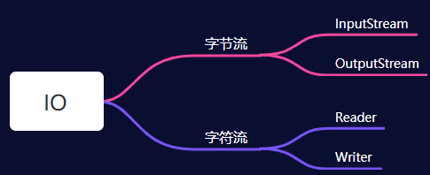
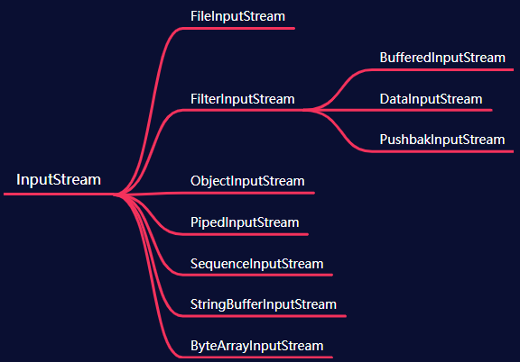
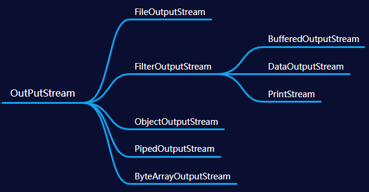
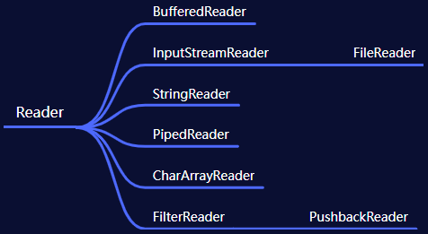
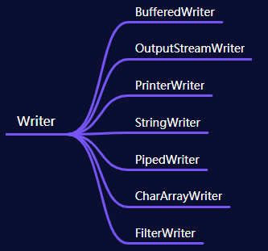

# IO

## IO简介

在Java中提供了IO接口，主要是用于文件读写，输入输出操作，IO是以流为基础进行操作的，流相当于是连续的
数据流。可以从数据流中读取数据，也可以往流中写数据。在java中IO流既可以是**字节流**也可以是**字符流**。

字节流就是数据以字节的形式进行IO操作。

字符流就是数据以字符的形式进行IO操作。

## IO分类


  

## IO的设计模式

在`javaIO`中有两个设计模式：**装饰者模式**、**适配器模式**。

- 装饰者模式

  给一个对象增加一个些新的功能，而且是动态的，要求装饰对象和被装饰对象实现同一个接口，装饰对象持有被装饰对象的实例，就是字符流相互装饰，或者字节流相互装饰，如`FileInputStrean`装饰成`BufferedReader`。

- 适配器模式

  就是将某一个类的接口转换成另外一个接口，就是字符流和字节流之间相互适配

# 字节流

## InputStream

 

```java
private static final int MAX_SKIP_BUFFER_SIZE = 2048;

// 每次从流里面读取一个字节数据，返回的是这个字节的ASCII码
public abstract int read();

// 从流里面读取指定长度字节数据，返回字节长度
public int read(byte b[]);

// 从文件流读取len长度的字节数据，并从字节数组off位置开始放数据
public int read(byte b[], int off, int len);

// 从数据流中跳过n长度个字节
public long skip(long n);

// 在不阻塞的情况下数据流中有多少个字节可以读取
public int available();

// 关闭流
public void close();

// 在数据流上做一个标记，通过reset方法可以从新挥着readlimit这个位置
public synchronized void mark(int readlimit);

// 重新定位数据流的位置
public synchronized void reset();

// 是否支持mark
public boolean markSupported();
```

## OutputStream

 

```java
// 向数据流中写一个字节
public abstract void write(int b);

// 向数据流中写一个字节数组
public void write(byte b[]);

// 向数据流中写一个字节数组，从字节数组off位置开始，len长度
public void write(byte b[], int off, int len);

// 刷新数据流
public void flush();

// 关闭流
public void close();
```

# 字符流

## Reader

 

- 变量

  ```java
  // 用于同步此流上的操作对象
  protected Object lock;
  ```

- 构造方法

  ```java
  // 空构造方法，同步锁是当前流对象
  protected Reader() {
      this.lock = this;
  }
  // 构造方法，指定对象为同步锁
  protected Reader(Object lock) {
      if (lock == null) {
          throw new NullPointerException();
      }
      this.lock = lock;
  }
  ```

- 方法

  ```java
  // 读取一个字符，并返回ascii码
  public int read();
  
  // 读取一个字符数组，并返回字符数组的长度
  public int read(char cbuf[]);
  
  // 读取len长度的字符，并从字符数组的off位置处放到字符数组中
  abstract public int read(char cbuf[], int off, int len);
  
  // 在字符流中标记一个位置
  public void mark(int readAheadLimit);
  
  // 回到mark的位置
  public void reset();
  ```

## Writer

 

- 变量

  ```java
  	
  	// 存放字符的字符数组
  	private char[] writeBuffer;
  
  	// 字符数组默认长度
  	private static final int WRITE_BUFFER_SIZE = 1024;
  
  	// 对象锁
    protected Object lock;
  ```

- 构造方法

  ```java
  // 空构造，对象锁为当前对象
  protected Writer() {
    this.lock = this;
  }
  
  // 指定锁对象
  protected Writer(Object lock) {
    if (lock == null) {
      throw new NullPointerException();
    }
    this.lock = lock;
  }
  ```

- 方法

  ```java
  // 往字符数组中写一个ascii码表示的字符
  public void write(int c);
  
  // 把cbuf中的元素写到字符数组中
  public void write(char cbuf[]);
  
  // 从字符数组cbuf的off位置开始，写len长度到字符数组中
  abstract public void write(char cbuf[], int off, int len);
  
  // 把字符串写入到字节数组中
  public void write(String str);
  
  // 从字符串的off开始写len长度到字符数组中
  public void write(String str, int off, int len);
  
  // 把字符序列csq加到字符数组元素的末尾
  public Writer append(CharSequence csq);
  
  // 从字符序列start到end位置的字符加到字符数组元素的末尾
  public Writer append(CharSequence csq, int start, int end);
  
  // 把字符加到字符数组的末尾
  public Writer append(char c);
  ```

