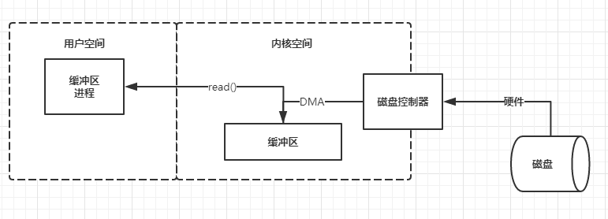
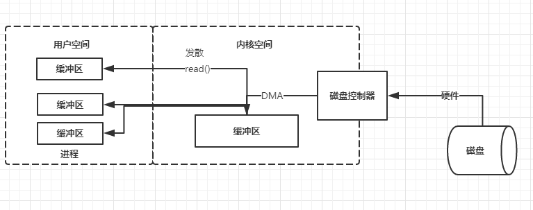
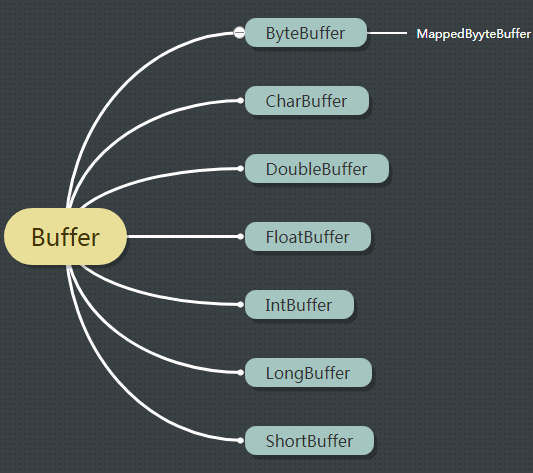
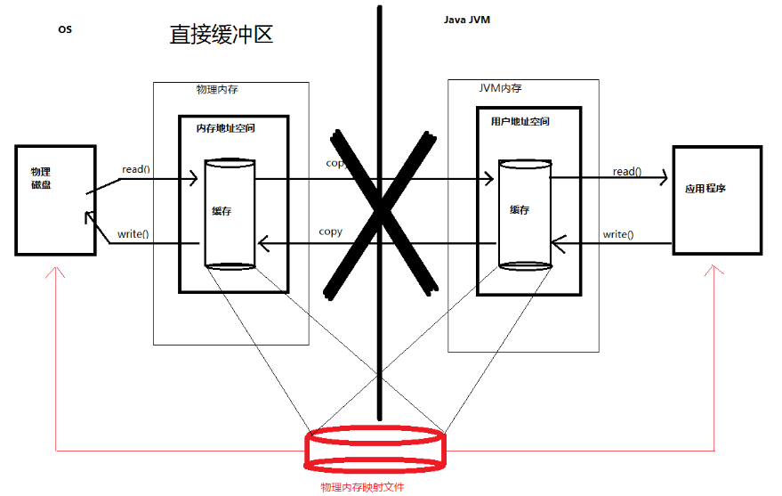
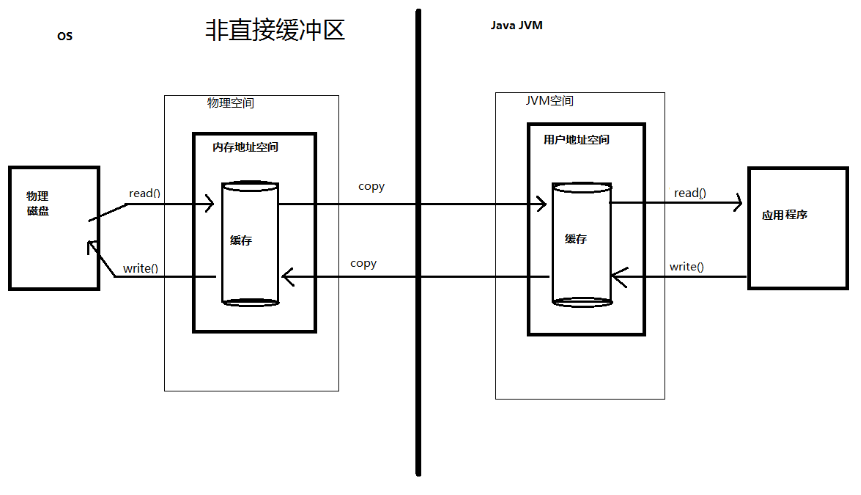
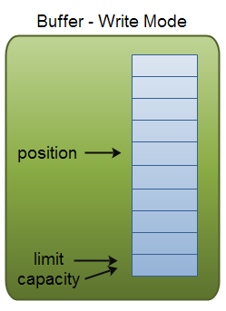
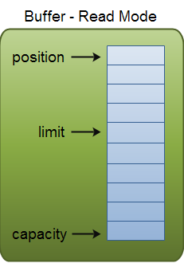
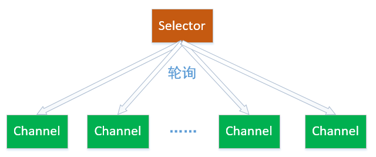

# NIO相关只是介绍

## 缓冲区

进程如何从磁盘取数据：进程使用`read()`系统调用，要求其缓冲区被填满。内核随即向磁盘控制硬件发出命令，要求其从磁盘读取数据。磁盘控制器把数据直接写入内核内存缓冲区，这一步通过DMA完成，无需主CPU协助。一旦磁盘控制器把缓冲区装，内核即把数据从内核空间的临时缓冲区拷贝进进程执行read()调用时指定的缓冲区。内核试图对数据进行告诉缓存或预读取，因此进程所需数据可能已经再内核空间。如果是这样该数据只需要简单拷贝出来即可。如果数据不再内核空间，则进程被挂起，内核着手把数据读进内存。

为什么不直接让磁盘控制器把数据送到用户空间的缓冲区？

1.硬件不能直接访问用户空间。

2.磁盘这样基于块存储的硬件设备操作的是固定大小的数据块，而用户进程请求的可能是任意大小的或非对齐的数据块，再数据往来于用户空间与存储设备的过程中，内核负责数据的分解、在组合工作，因此充当中间的角色。



## 发散/汇聚

许多操作系统能把组装/分解过程进行的更加高效。根据发散/汇聚的概念，进程只需要一个系统调用，就能把一连串缓冲区地址传递给操作系统。然后，内核就可以顺序填充或排干多个缓冲区，读的时候就把数据发散到多个用户空间缓冲区，写时候再从多个缓冲区把数据汇聚起来。这样用户进程就不必多次执行系统调用。如果系统配置有多个cpu，甚至可以同时填充或排干多个缓冲区。



# NIO简介

## NIO概述

NIO(New Input/Output)类，是在JDK1.4中引入的，是一种基于通道和缓冲区的I/O方式，它可以使用native函数库直接分配堆外内存，然后通过一个存储在Java堆的DirectByteBuffer对象作为这块内存的引用进行操作，避免了在Java堆和Native堆中来回复制数据。

​	NIO是一种同步非阻塞的IO模型。同步是指线程不断轮询IO事件是否就绪，非阻塞是指线程在等待IO的时候，可以同时做其他任务。同步的核心就是Selector，Selector代替了线程本身轮询IO事件，避免了阻塞同时减少了不必要的线程消耗；非阻塞的核心就是通道和缓冲区，当IO事件就绪时，可以通过写到缓冲区，保证IO的成功，而无需线程阻塞式地等待。

## NIO核心

NIO主要有三大部分：Channel(通道)、Buffer(缓冲区)、Selector。NIO是基于Channel和Buffer进行操作，数据总是从通道读取到缓冲区中，或者从缓冲区写入到通道中。Selector用于监听多个通道的事件。因此，单个线程可以监听多个数据通道。

## NIO和传统IO(BIO)的区别

NIO和传统IO之间的第一个区别是，IO是面向流的，NIO是面向缓冲区的。IO的各种流是阻塞的，即当一个线程调用read()或write()时，该线程被阻塞，直到有一些数据被读取，或数据完全写入。该线程在此期间不能再干任何事情。

​	NIO是非阻塞模式，如果线程从某一个通道发送请求读取数据，但是又没有读取到数据，那就什么都不会获取，而不是保持线程阻塞，所以直到数据变得可以读取之前，该线程可以继续做其他的事情。同理写入的时候也是如此，不需要等待完全写入，这个线程可以去做别的事情，所以一个线程可以管理多个输入和输出通道。

# Buffer

## Buffer简介

Buffer本质上是一块可以写入数据，然后可以从中读取数据的内存，实质上是一个个数组。

## Buffer的种类

### 按数据类型分

这些种类代表了不同的数据类型。其中MappedByteBuffer是ByteBuffer专门用于内存映射文件的一种特例。



### 按特点分

缓冲区分为直接缓冲区和非直接缓冲区：

- 直接缓冲区

通过`allocate()`方法分配缓冲区，将缓冲区建立再JVM内存中



- 非直接缓冲区

通过`allocateDirect`方法分配直接缓冲区



## Buffer属性

缓冲区本质上是一块可以写入的数据，然后可以从中读取数据的内存。这块内存被包装成NIO Buffer对象。Buffer有四个属性。

### 容量(Capacity)

容量是能够容纳的数据元素的最大数量，这个值在Buffer创建时就设定了，不能修改。

### 位置(position)

当你写数据到Buffer中时，position表示当前的位置，初始的position值为0，当一个byte、long等数据写到Buffer后，position会向前移动到下一个可插入数据的Buffer单元。position最大可为capacity-1，因为从零开始的。当读取数据时，position也是从0开始的，向下移动。

### 上界(limit)

在写模式下，Buffer的limit表示你最多能往Buffer里写多少数据。在写模式下limit=capaciy。

当Buffer切换到读模式时，limit表示你最多能读到多少数据。因此当Buffer切换到读模式时，limit会被设置成写模式下的positio值。

### 标记(Mark)

## Buffer模式

Buffer有两种模式：读模式，写模式

### Buffer写模式

buffer在写模式下：position=0,  limit=capacity=size



### Buffer读模式

Buffer在读模式下：limit=position， position=0， capacity=size



### 读写切换

写切换到读：flip()：limit=position, position=0

读切换到写：clear() ：position=0, limit=capacity

## Buffer创建

Buffer的创建有两种方式：分配或包装。

### 分配创建

分配创建一个缓冲区对象并分配一个私有的空间来存容量大小的数据元素。

```java
ByteBuffer buffer = ByteBuffer.allocate(1024);
```

### 包装创建

包装操作创建一个缓冲区对象但是不分配任何空间来存储数据元素。它使用你提供的数组作为存储空间来存储缓冲区中的数据元素。包装创建的总是非直接

```java
byte[] bytes = new byte[1024];
ByteBuffer buffer = ByteBuffer.wrap(bytes);
```

# 通道Channel

## Channel概述

Channel就是一个通道，用于传输数据，两端分别是**缓冲区**和**实体**(文件或套接字)，通道的特点是：既可以从通道中读取数据，又可以写数据到通道。但流的读写通常是单向的、**通道可以异步地读写**、通道中的数据总是要先读到一个Buffer，或者总是要从一个Buffer中写入。

## Channel分类

- `FileChannel`：从文件中读写数据
- `DatagramChannel`：通过UDP读写网络中的数据
- `SocketChannel`：通过TCP读写网络中的数据
- `ServerSocketChannel`：可以监听新进来的TCP连接，想WEB服务器那样，对每一个新进来的请求创建一个`SocketChannel`。

四中分类对应不同实体：包括了文件IO、TCP和UDP网络IO。

## Channel接口源码

在Channel接口中只有打开和关闭两个方法，主要靠实现类来实现。

```java
public interface Channel {
    public boolean isOpen();
    public void close() throws IOException;
}
```

## 文件通道`FileChannel`

### 文件通道概述	

`FileChannel`对象不能直接创建，只能通过`FileInputStream`、`OutputStream`、`RandomAccessFile`对象的`getChannel()`来获取。`FileChannel`无法设置为非阻塞模式，它总是运行在阻塞模式下。

通道只能使用ByteBuffer，FileChannel是线程安全的，可以多个线程在同一个实例上并发操作，Channel的读写操作都是使用的synchronized的。大那是有些方法必须是单线程操作。

### 文件通道方法

#### 读文件`read`

```java
public void channelTest() throws Exception{
    RandomAccessFile raf = new RandomAccessFile("E:\\idea\\study\\file\\demo.txt", "rw");
    FileChannel channel = raf.getChannel();
    ByteBuffer buffer = ByteBuffer.allocate(1024);
    int res = channel.read(buffer);
    while (res != -1) {
        buffer.flip();
        while(buffer.hasRemaining()) {
            System.out.print((char)buffer.get());
        }
        buffer.clear();
        res = channel.read(buffer);
    }
    channel.close();
}
```

#### 写文件`write`

```java
public void channelTest() throws Exception{
    FileOutputStream fos = new FileOutputStream("E:\\idea\\study\\file\\demo.txt");
    FileChannel channel = fos.getChannel();
    String message = "channel file output";

    ByteBuffer buffer = ByteBuffer.allocate(1024);
    buffer.put(message.getBytes());
    buffer.flip();
    channel.write(buffer);
    channel.close();
}
```

#### 通道的文件位置`size`

- 文件内容

```java
//demo.txt
abcdefghijklmn
```

- 代码

```java
// channel的size，就是文本的内容长度
RandomAccessFile raf = new RandomAccessFile("E:\\idea\\study\\file\\demo.txt", "rw");
FileChannel channel = raf.getChannel();
System.out.println("size is: " + channel.size());
System.out.println("position is: " + channel.position());
```

#### 设置通道的文件位置`position`

```java
RandomAccessFile raf = new RandomAccessFile("E:\\idea\\study\\file\\demo.txt", "rw");
FileChannel channel = raf.getChannel();
//设置通道的位置，从3开始读取数据到缓冲区
channel.position(3);
ByteBuffer buffer = ByteBuffer.allocate(10);
channel.read(buffer);
buffer.flip();
while (buffer.hasRemaining()) {
    //defghijklm
    System.out.print((char)buffer.get());
}
channel.close();
```

#### 截取文件`truncate`


使用`truncate`方法截取一个文件。截取文件时，文件将指定长度后面的部分将被删除。

```java
//file content
//abcdefghijklmnopkrstuvwxyz
@Test
public void channelTest() throws Exception{
    RandomAccessFile raf = new RandomAccessFile(filePath2, "rw");
    FileChannel channel = raf.getChannel();
    //channel的size就是文件内容的长度
    //如果是中文一个三个字节长度
    System.out.println(channel.size());//26
    channel.truncate(10);
    System.out.println(channel.size());//10
}
```

#### 强制刷新数据到磁盘`force`

```java
@Test
public void channelTest() throws Exception{
    RandomAccessFile raf = new RandomAccessFile(filePath2, "rw");
    FileChannel channel = raf.getChannel();
   	channel.force(true);
}
```

在通道中使用truncate截取一个文件。截取文件时，文件将指定长度后面的部分将被删除。

```java
public void channelTest () throws Exception{
    RandomAccessFile randomAccessFile = new RandomAccessFile("F:\\project\\study\\file\\demo.txt", "rw");
    FileChannel channel = randomAccessFile.getChannel();
    //这里的Channel的长度就是文件内容的长度
    System.out.println("original size: " + channel.size());
    //设置通道的长度为10之后，后面的数据都会被删除
    channel.truncate(10);
    System.out.println(channel.size());// size is ten
    ByteBuffer byteBuffer = ByteBuffer.allocate(1024);
    channel.read(byteBuffer);
    byteBuffer.flip();
    while(byteBuffer.hasRemaining()) {
        System.out.print((char) byteBuffer.get());
    }
}
```

## 网络通道`SocketChannel`

### 网络通道概述

- 读取通道信息

SocketChannel是一个连接到TCP套接字的通道，获取的方式有两种：

1、打开一个SocketChannel并连接到互联网上某台服务器

2、一个新连接到ServerSocketChannel时，会创建一个SocketChannel

### 代码实例

```java
public void socketChannelTest() throws Exception {
    //获取socket通道
    SocketChannel socket = SocketChannel.open();
    //设置为非阻塞模式
    socket.configureBlocking(false);
    //建立连接，非阻塞模式下，该方法可能在连接建立之前就返回
    socket.connect(new InetSocketAddress("127.0.0.1", 80));
    while (!socket.finishConnect()) {
        System.out.println("连接未建立");
        Thread.sleep(5);
    }
    ByteBuffer buffer = ByteBuffer.allocate(48);
    int byteRead = socket.read(buffer);
    System.out.println(byteRead);
    socket.close();
    buffer.clear();
}
```

由于是非阻塞模式，通道在调用方法connect/read/writer这三个方法时，会出现这些情况：连接未建立，connect方法就返回了；尚未读取任何数据时，read方法就返回；尚未写出任何内容，writer就返回。

- 向通道中写入数据

```java
public void serverSocketTest() throws Exception {
    SocketChannel socket = SocketChannel.open();
    String str = "non-blocking socket channel";
    ByteBuffer buffer = ByteBuffer.allocate(100);
    buffer.put(str.getBytes());
    buffer.flip();
    while (buffer.hasRemaining()) {
        socket.write(buffer);
    }
    socket.close();
    buffer.clear();
}
```

SocketChannel.write()方法的调用是在一个while循环中的，Writer()方法无法保证能写多少字节到SocketChannel。所以，我们重复调用write()直到Buffer没有要写的字节为止。

## 网络通道`ServerSocketChannel`

### 网络通道概述

ServerSocketChannel是一个可以监听新来的TCP连接的通道

### 代码实例

```java
public void serverSocketTest() throws Exception {
    ServerSocketChannel serverSocketChannel = ServerSocketChannel.open();
    serverSocketChannel.socket().bind(new InetSocketAddress(80));
    serverSocketChannel.configureBlocking(false);
    while (true) {
        SocketChannel socketChannel = serverSocketChannel.accept();
        if (null != serverSocketChannel) {
            //TODO do something
        }
    }
}
```

通过accept方法监听新接入进来的连接，这个方法会返回一个包含新进来的连接的SocketChannel(服务器端的通道的获取方式)。如果是阻塞模式，该方法会一直阻塞直到有心的连接进来。如果是非阻塞模式，则accept方法会立刻返回，返回值是null。

# 通道间传递数据

## 概述

在NIO中，如果两个通道中有一个是FileChannel，那你可以直接将数据从一个channel传输到另外一个channel。

## transferFrom

to-transferFrom-from

```java
public void channelTest() throws Exception{
    RandomAccessFile raf = new RandomAccessFile("F:\\project\\study\\file\\demo.txt", "rw");
    FileChannel channel = raf.getChannel();
    System.out.println(channel.size());
    RandomAccessFile des = new RandomAccessFile("F:\\project\\study\\file\\destination.txt", "rw");
    FileChannel destination = des.getChannel();

    destination.transferFrom(channel, 0, channel.size());
}
```

## transferTo

from-transferTo-to

```java
public void channelTest() throws Exception{
        RandomAccessFile raf = new RandomAccessFile("F:\\project\\study\\file\\demo.txt", "rw");
        FileChannel channel = raf.getChannel();
        System.out.println(channel.size());

        RandomAccessFile des = new RandomAccessFile("F:\\project\\study\\file\\destination.txt", "rw");
        FileChannel destination = des.getChannel();
        channel.transferTo(0, channel.size(), destination);
    }
```

# 选择器`Selector`

## 什么是`Selector`

Selector一般称为选择器，它是Java NIO核心组件中的一个，用于检查一个或多个NIO Channel的状态是否处于可读，可写。如此可以实现单线程管理多个Channel，也可以管理多个网络链接。

但是因为一个线程中使用了多个Channel，因此会造成每个Channel传输效率的降低。



## 使用`Selector`

## 使用Selector的好处

使用Selector的好处在于，使用更少的线程就可以来处理通道了，相比使用多线程，避免了线程上下文切换带来的开销。

## Selector使用流程概述

为了使用`Selector`，我们首先需要将`Channel`注册到`Selector`中，随后调用`Selector`的`select()`方法，这个方法会阻塞，直到注册在`Selector`中的`Channel`发送可读写事件，当这个方法返回后，当前的这个线程就可以处理Channel的事件了。

## Selector使用流程

- 创建Selector

通过调用Selector.open()方法创建一个Selector对象。

```java
Selector selector = Selector.open();
```

- 将Channel注册到选择器中

为了使用选择器管理Channel，我们需要将Channel注册到选择器中，如果一个Channel要注册到Selector中，那么这个Channel必须是非阻塞的，即可以设置属性channel.configureBlocking(false),因为Channel必须是非阻塞的，所有FileChannel是不能够使用选择器的，因为FileChannel都是阻塞的。一个Channel只能注册到一个Selector一次，如果多注册，以最后的为准。

```java
SocketChannel socketChannel = SocketChannel.open();
socketChannel.configureBlocking(false);
// 注册channel到selector
socketChannel.register(selector, SelectionKey.OP_ACCEPT);

```

- 感兴趣事件

当我们把Channel注册到Selector上时，需要选择一个感兴趣的事件。在SelectionKey类中有四个变量，表示四个事件，可以从中选择其中一个或多个事件(用|符号分割多个事件)作为感兴趣的事件，用于Selector监听。

```java
// 读事件，表示Buffer可读
public static final int OP_READ = 1 << 0 
// 写事件，表示Buffer可写
public static final int OP_WRITE = 1 << 2
// 连接事件(TCP 连接)
public static final int OP_CONNECT = 1 <<3
// 确认事件
public static final int OP_ACCEPT = 1 <<4
```

## SelectionKey

### 什么是SelectionKey

当我们把Channel注册到Selector上时，会返回一个SelectionKey对象，这个对象包含了如下内容：

- interest set
- ready set 
- channel 
- selector
- attached object

### interest set 集合

interest集合是你所选择的感兴趣的事件集合 。

```java
ServerSocketChannel socketChannel = ServerSocketChannel.open();
Selector selector = Selector.open();
socketChannel.configureBlocking(false);
SelectionKey selectionKey = socketChannel.register(selector, SelectionKey.OP_ACCEPT);

int interestSet = selectionKey.interestOps();
System.out.println(interestSet)
```

### ready集合

代表了Channel所准备好了的操作。

```java
// 准备好了的注册事件的值
int readySet = selectionKey.readyOps();
// 也可以使用以下几种方法判断
selectionKey.isAcceptable();
selectionKey.isConnectable();
selectionKey.isReadable();
selectionKey.isWritable();
```

### Channel和Selector

通过SelectionKey可以获取对应的Channel和Selector

```java
Channel  channel  = selectionKey.channel();
Selector selector = selectionKey.selector();
```

### Attaching Object

可以在selectionKey中附加一个对象，或者在注册的时候直接附加

```java
selectionKey.attach(new Object());
Object attachedObj = selectionKey.attachment();
// 直接在注册时附加
SelectionKey key = channel.register(selector, SelectionKey.OP_READ, new Object());
```

## 获取Channel

通过Selector可以获取对某件事已经准备好了的一个或多个Channel。

```java
// 超时等待3秒
selector.select(3);
```

如果有多个Channel已经准备好了，通过以下方法获取

```java
Set<SelectionKey> selectedKeys = selector.selectedKeys();
Iterator<SelectionKey> keyIterator = selectedKeys.iterator();
while (keyIterator.hasNext()) {
    SelectionKey key = keyIterator.next();
    if (key.isAcceptable()) {
        
    } else if (key.isConnectable()) {
        
    } else if (key.isReadable()) {
        
    } else if (key.isWritable()) {
	}
    keyIterator.remove();
}
```


