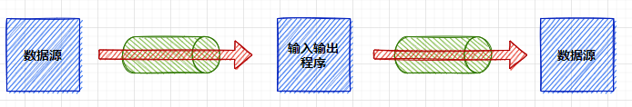
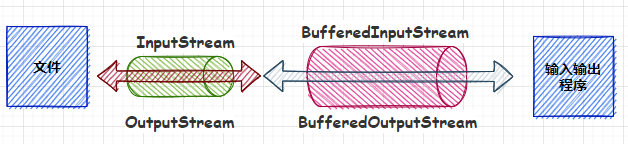

# IO介绍

## 什么是IO流

在`Java`中提供了`IO`接口，主要用于读写，输入输出操作。`IO`是以流为基础进行操作的，流相当于是连续的
数据流。可以从数据流中读取数据，也可以往流中写数据。



## IO分类

- 按流向分：输入流和输出流
- 按数据类型分：字节流和字符流
- 按功能类型分：管道流、文件流、数组流、缓冲流、对象流、转换流、基本数据类型流
- 按照角色类型：节点流和处理流
  - 节点流：从源直接读取数据
  - 处理流：对一个已经存在的流连接和封装，通过所封装的流的功能读写数据，处理流的构造方法都有一个    节点流参数


## IO的设计模式

在`javaIO`中有两个设计模式：**装饰者模式**、**适配器模式**。

- 装饰者模式

  给一个对象增加一个些新的功能，而且是动态的，要求装饰对象和被装饰对象实现同一个接口，处理流装饰节点流。

- 适配器模式

  适配器负责将一个类的接口转换成另外一个接口，一般是指节点流，比如`StringReader`继承了`Reader`同时有一个`String`对象，将`String`对象的接口适配成`Reader`类型的接口。在调用`Reader`的`read()`方法，实际上是在调用`String`对象的方法。

# IO体系

`IO`流的顶层抽象类可以分为四种：字节输入流`InputStream`，字节输出流`OutputStream`，字符输入流`Reader`，字符输出流`Writer`。

## 字节输入流

### 概述

字节输入流`InputStream`是一个抽象类，用于字节的输入。字节输入流可以读取一个字节或者一个字节数组。字节输入流读取字节之后，返回的是字节的`ASCII`码，如果读取的是字节数组，就将字节的`ASCII`存放到数组当中，然后返回字节数组的长度。

```java
public abstract class InputStream implements Closeable
```

### 实现类


### 方法

```java
/**
 * 从数据流中读取一个字节数据，返回的是字节的ASCII码
 */
public abstract int read();

/**
 * 从数据流中读取一个字节数组长度的字节数据，并将字节数据放到字节数组中，返回读取的字节数据个数
 */
public int read(byte b[]);

/**
 * 从数据流中读取len长度的字节数据，并从字节数组的off位置开始放数据，返回读取的字节数据个数
 */
public int read(byte b[], int off, int len);

/**
 * 从数据流中跳过n长度的字节
 */
public long skip(long n);

/**
 * 在不阻塞的情况下数据流中有多少个字节可以读取
 */
public int available();
```

## 字节输出流

### 概述

字节输出流`OutputStream`是一个抽象类，用于输出字节数据，它实现了`Flushable`接口，用于刷新流，但是`flush`并不是强制的，而是针对有缓冲区的。

```java
public abstract class OutputStream implements Closeable, Flushable
```

### 实现类


### 方法

```java
/**
 * 向数据流中写一个字节数据
 */
public abtract void write(int b);

/**
 * 向数据流中写一个字节数组的字节数据
 */
public void write(byte b[]);

/**
 * 向数据流中写一个字节数组的字节数据，从字节数组off位置开始，len长度
 */
public void write(byte b[], int off, int len);
```


## 字符输入流

### 概述

字符输入流`Reader`是一个抽象类，用于读取字符。

```java
public abstract class Reader implements Readable, Closeable
```

### 实现类


### 方法

```java
/**
 * 用于同步此流上的操作对象
 */
protected Object lock;

/**
 * 空构造方法，同步锁是当前流对象
 */
protected Reader();

/**
 * 构造方法，指定对象为同步锁
 */
protected Reader(Object lock);

/**
 * 读取一个字符，并返回ascii码
 */
public int read();

/**
 * 读取一个字符数组，并返回字符数组的长度
 */
public int read(char cbuf[]);

/**
 * 读取len长度的字符，并从字符数组的off位置处放到字符数组中
 */
abstract public int read(char cbuf[], int off, int len);

/**
 * 在字符流中标记一个位置
 */
public void mark(int readAheadLimit);

/**
 * 回到mark的位置
 */
public void reset();
```

## 字符输出流

### 概述

字符输出流`Writer`是一个抽象类，用于写字符，它实现了`Appendable`用于追加字符。

```java
public abstract class Writer implements Appendable, Closeable, Flushable
```

### 实现类


### 方法

```java
/**
 * 往字符数组中写一个ascii码表示的字符
 */ 
public void write(int c);

/**
 * 把cbuf中的元素写到字符数组中
 */ 
public void write(char cbuf[]);

/**
 * 从字符数组cbuf的off位置开始，写len长度到字符数组中
 */ 
abstract public void write(char cbuf[], int off, int len);

/**
 * 把字符串写入到字节数组中
 */ 
public void write(String str);

/**
 * 从字符串的off开始写len长度到字符数组中
 */ 
public void write(String str, int off, int len);

/**
 * 把字符序列csq加到字符数组元素的末尾
 */ 
public Writer append(CharSequence csq);

/**
 * 从字符序列start到end位置的字符加到字符数组元素的末尾
 */ 
public Writer append(CharSequence csq, int start, int end);

/**
 * 把字符加到字符数组的末尾
 */ 
public Writer append(char c);
```

# 文件流

## 概述

文件流包含了字节文件流和字符文件流两种类型，其中字节文件流是节点流，字符文件流是处理流。

- FileInputStream
- FileOutputStream
- FileReader
- FileWriter

## 数据流向

### 字节文件流

字节流数据是从文件到输入输出程序。


### 字符文件流

字符流数据是先流向字节流再流向字符流。


## 源码解析

### 字节文件输入流

- 构造方法

  字节输入流常用的构造方法有两种，能接受文件和字符串的参数，字符串构造也是创建一个文件。

```java
// 字符串构造，也是创建一个文件
public FileInputStream(String name) throws FileNotFoundException {
	this(name != null ? new File(name) : null);
}
// 文件构造方法
public FileInputStream(File file) throws FileNotFoundException {
    String name = (file != null ? file.getPath() : null);
    // 创建一个文件描述符
    fd = new FileDescriptor();
   	// 将文件描述符加入到otherPath集合中，释放的时候可以一起释放
    fd.attach(this);
    path = name;
    // 调用native的open方法
    open(name);
}
```

- 读取数据

  读取数据是调用`native`方法读取数据，可以每次读取一个字节，也可以读取一个字节数组的数据

### 字节文件输出流

- 构造方法

  字节输出常用的构造方法和字节输入类似，只不过是多了一个布尔类型的`append`参数，这个参数决定是在文件里面追加内容，还是从头开始写，默认是覆盖从头开始。

- 写数据

  写数据也是调用的`native`方法，可以写一个字节的数据，也可以写一个字节数组的数据。除此之外写方法也有一个`append`参数，表示是追加写还是覆盖写。

> FileDescriptor：是一个文件描述符，打开一个文件或者套接字，操作系统内核都会返回一个文件描述符，文件描述符有三个值：0-标准输入，1-标准输出，2-标准错误输出

### 字符文件输入流

字符文件输入流只有构造方法，对数据的操作是借助转换流`InputStreamReader`来完成的，字符输入流的构造方法是创建一个字节文件输入流

### 字符文件输出流

字符文件输出流只有构造方法，对数据的操作是借助转换流`OutputStreamWriter`来完成的，字符输出流的构造方法是创建一个字节文件输出流

## 示例

- 字节文件流

```java
/**
 * 字节输入流
 */
FileInputStream fis = new FileInputStream("./file");
byte[] bytes = new byte[2];
int len;
// 可以一次读取一个字节或者多个字节
while((len = fis.read(bytes)) != -1) {
    System.out.println(new String(bytes, 0, len));
}
fis.close();

/**
 * 字节输出流
 */
FileOutputStream fos = new FileOutputStream("./file");
fos.write("helloio".getBytes());
fos.close();
```

# 内存流

## 概述

内存流包含了字节数组流和字符数组流

- ByteArrayInputStream
- ByteArrayOutputStream
- CharArrayReader
- CharArrayWriter

## 数据流向

内存流是从内存到输入输出程序


## 源码分析

### 字节数组输入流

- 构造方法

  字节数组输入流有两个构造方法，初始化一个字节数组，同时可以指定字节数组的起始位置和长度

  ```java
  // 初始化一个字节数组，读取的时候从0的位置开始读取
  public ByteArrayInputStream(byte buf[]) {
      this.buf = buf;
      this.pos = 0;
      this.count = buf.length;
  }
  // 初始化一个字节数组，读取的时候从pos的位置开始读取
  public ByteArrayInputStream(byte buf[], int offset, int length) {
      this.buf = buf;
      this.pos = offset;
      this.count = Math.min(offset + length, buf.length);
      this.mark = offset;
  }
  ```

- 读取数据

  读取数据可以每次读取一个字节，也可以读取一个字节数组，底层采用`System.arraycopy`方法将字节数组的数据复制到传入的字节数组中

### 字节数组输出流

- 构造方法

  字节数组输出流构造方法主要是创建一个字节数组，可以指定字节输入的长度，不指定的时候默认是32.

  ```java
  // 默认长度32
  public ByteArrayOutputStream() {
      this(32);
  }
  public ByteArrayOutputStream(int size) {
      buf = new byte[size];
  }
  ```

- 数组扩容

  字节数组输入流，可以支持动态扩容，每次扩容为左移一位，相当于增加一倍。

- 输出数据

  输出数据是将字节数据放到字节数组输出流的字节数组里面

### 字符数组输入流

- 构造方法

  字符数组输入流构造方法创建一个字符数组

  ```java
  public CharArrayReader(char buf[]) {
      this.buf = buf;
      this.pos = 0;
      this.count = buf.length;
  }
  ```

- 读取数据

  读取数据是返回字符数组中的元素

### 字符数组输出流

- 构造方法

  创建一个指定长度的字符数组，默认是32位

  ```java
  // 默认32位
  public CharArrayWriter() {
  	this(32);
  }
  public CharArrayWriter(int initialSize) {
  	buf = new char[initialSize];
  }
  ```

- 输出数据

  输出数据就是将字符放到字符数组中

## 示例

### 字节数组内存流

```java
ByteArrayInputStream byteArrayInputStream = new ByteArrayInputStream("helloid".getBytes(StandardCharsets.UTF_8));
ByteArrayOutputStream byteArrayOutputStream = new ByteArrayOutputStream();
int len;
while ((len = byteArrayInputStream.read()) != -1) {
    byteArrayOutputStream.write(len);
}
System.out.println(byteArrayOutputStream);
```

### 字符数组内存流

```java
CharArrayReader charArrayReader = new CharArrayReader("helloio".toCharArray());
CharArrayWriter charArrayWriter = new CharArrayWriter();
int len;
while ((len = charArrayReader.read()) != -1) {
    charArrayWriter.write(len);
}
System.out.println(charArrayWriter);
```

# 缓冲流

## 概述

缓冲流包含了字节缓冲流和字符缓冲流

- BufferedInputStream
- BufferedOutputStream
- BufferedReader
- BufferedWriter

## 数据流向

### 字节缓冲流

字节缓冲流是处理流，是在节点流的基础上操作的



### 字符缓冲流

字符缓冲流是处理流，是在节点流的基础上操作的


## 源码解析

### 字节输入缓冲流

- 变量

  ```java
  // 字节数组的元素数量，范围是[0, buf.length]
  protected int count;
  
  // 下一个读取字符的索引，范围是[0, count]
  protected int pos;
  
  /**
   * 开启重复读取数据的变量
   */
  // 这个值是上次调用mark方法后pos的值，范围是[-1, pos]
  protected int markpos = -1;
  // 限制可重复度的最大长度
  protected int marklimit;
  ```

- 构造方法

  字节输入缓冲流，在创建一个字节输入流对象的同时，也会初始化一个默认长度为8192的字节数组

  ```java
  public BufferedInputStream(InputStream in) {
      this(in, 8192);
  }
  public BufferedInputStream(InputStream in, int size) {
      super(in);
      // 初始化一个字节数组
      buf = new byte[size];
  }
  ```

- 读取数据

  ```java
  public synchronized int read() throws IOException {
      // 当索引的位置大于字节数组的元素个数，相当于字节数组中的元素已经读取完了
      if (pos >= count) {
          // 从数据源中读取数据填充到字节数组中
          fill();
          if (pos >= count)
              return -1;
      }
      // 从字节数组中返回元素
      return getBufIfOpen()[pos++] & 0xff;
  }
  private void fill() throws IOException {
      // 获取字节数组对象
      byte[] buffer = getBufIfOpen();
      // 没有使用过mark标记，直接将pos指向字节数组的首位，就是将字节数组后面的元素直接丢弃
      if (markpos < 0)
          pos = 0;
      // 已经读取到字节数组的最大长度了，及pos已经指向字节数组的最后一个元素了
      else if (pos >= buffer.length) {
          // 调用过mark方法，将markpos位置开始的元素移动到前面，markpos前面的数据直接丢弃，后面的不		   // 能丢弃所以要移动到前面
          if (markpos > 0) {
              int sz = pos - markpos;
              System.arraycopy(buffer, markpos, buffer, 0, sz);
              pos = sz;
              markpos = 0;
          // 因为：pos >= buffer.length， 这里相当于无效mark，因为已经重复读取过数据了
          } else if (buffer.length >= marklimit) {
              markpos = -1;   
              pos = 0; 
          // 字节数组不断扩容之后，已经达到最大了，抛出异常
          } else if (buffer.length >= MAX_BUFFER_SIZE) {
              throw new OutOfMemoryError("Required array size too large");
          } else {
              // 2倍的pos，MAX_BUFFER_SIZE 最小值作为新的字节数组的长度
              int nsz = (pos <= MAX_BUFFER_SIZE - pos) ?
                  pos * 2 : MAX_BUFFER_SIZE;
              // 如果比marklimit大，直接扩容到marklimit
              if (nsz > marklimit)
                  nsz = marklimit;
              byte nbuf[] = new byte[nsz];
              System.arraycopy(buffer, 0, nbuf, 0, pos);
              if (!bufUpdater.compareAndSet(this, buffer, nbuf)) {
                  
                  throw new IOException("Stream closed");
              }
              buffer = nbuf;
          }
      }
      count = pos;
      // 从文件中继续读取数据放到字节数组中
      int n = getInIfOpen().read(buffer, pos, buffer.length - pos);
      if (n > 0)
          count = n + pos;
  }
  ```

- 重复读取数据

  ```java
  // 标记一下markPos的位置为现在pos的位置，并且设置可重复读的最大长度
  public synchronized void mark(int readlimit) {
      marklimit = readlimit;
      markpos = pos;
  }
  // 重置的时候将pos又还原到最开始的索引处
  public synchronized void reset() throws IOException {
      getBufIfOpen();
      if (markpos < 0)
          throw new IOException("Resetting to invalid mark");
      pos = markpos;
  }
  ```


### 字节输出缓冲流

- 构造方法

  字节输出缓冲流的构造方法是创建一个字节输出流对象，同时维护一个8192长度的字节数组缓冲区

  ```java
  public BufferedOutputStream(OutputStream out) {
      this(out, 8192);
  }
  public BufferedOutputStream(OutputStream out, int size) {
      super(out);
      buf = new byte[size];
  }
  ```

- 写数据

  写数据是先写到字节数组中，如果字节数组的元素达到了字节数组的长度，就写到文件里面去

  ```java
  public synchronized void write(int b) throws IOException {
      if (count >= buf.length) {
          flushBuffer();
      }
      buf[count++] = (byte)b;
  }
  public BufferedReader(Reader in, int sz) {
      super(in);
      this.in = in;
      cb = new char[sz];
      nextChar = nChars = 0;
  }
  ```

### 字符输入缓冲流

- 构造方法

  字符缓冲流的构造方法和字节缓冲流类似，在创建一个流的同时，内部也维护了一个默认为8192长度的字符数组。

  ```java
  public BufferedReader(Reader in) {
      this(in, 8192);
  }
  public BufferedReader(Reader in, int sz) {
      super(in);
      this.in = in;
      cb = new char[sz];
      nextChar = nChars = 0;
  }
  ```

- 读数据

  读取数据是从字符数组中读取，读取完了之后从流中获取数据填充到字符数组中

  ```java
  public int read() throws IOException {
      synchronized (lock) {
          ensureOpen();
          for (;;) {
              // 下一个要读取的 大于 字符数据中的元素个数，就填充数据
              if (nextChar >= nChars) {
                  fill();
                  if (nextChar >= nChars)
                      return -1;
              }
              if (skipLF) {
                  skipLF = false;
                  if (cb[nextChar] == '\n') {
                      nextChar++;
                      continue;
                  }
              }
              return cb[nextChar++];
          }
      }
  }
  private void fill() throws IOException {
      int dst;
      if (markedChar <= UNMARKED) {
          // 未调用mark方法，直接舍弃数据，读取数据的指针索引指向字符数组第一位
          dst = 0;
      } else {
          int delta = nextChar - markedChar;
          // 标记的数据已经读取过了，直接舍弃字符数组的数据
          if (delta >= readAheadLimit) {
              /* Gone past read-ahead limit: Invalidate mark */
              markedChar = INVALIDATED;
              readAheadLimit = 0;
              dst = 0;
          } else {
              if (readAheadLimit <= cb.length) {
                  // 将要读取的位置到标记的位置的字符串，这是没有读取的，移动到前面
                  System.arraycopy(cb, markedChar, cb, 0, delta);
                  markedChar = 0;
                  dst = delta;
              } else {
                  // 标记位置大于缓冲区大小，重新调整缓冲区大小，并将将要读取的位置到标记位置的
                  // 字符串移动到前面
                  char ncb[] = new char[readAheadLimit];
                  System.arraycopy(cb, markedChar, ncb, 0, delta);
                  cb = ncb;
                  markedChar = 0;
                  dst = delta;
              }
              nextChar = nChars = delta;
          }
      }
  	// 读取数据放到字符数组中
      int n;
      do {
          n = in.read(cb, dst, cb.length - dst);
      } while (n == 0);
      // 有读取到数据，重新设置将要读取的索引和字符数组中元素的个数
      if (n > 0) {
          nChars = dst + n;
          nextChar = dst;
      }
  }
  ```

### 字符输出缓冲流

- 构造方法

  字符输出缓冲流构造方法是新建一个输出流和一个字符缓冲数组

  ```java
  public BufferedWriter(Writer out) {
      this(out, 8192);
  }
  public BufferedWriter(Writer out, int sz) {
      super(out);
      this.out = out;
      cb = new char[sz];
      nChars = sz;
      nextChar = 0;
  }
  ```

- 写数据

  写输入是先往字符数组中写，字符数组满了之后往流里面写

## 示例

### 字节缓冲流

```java
/**
 * 字节输入缓冲流
 */
BufferedInputStream bufferedInputStream = new BufferedInputStream(new FileInputStream("./file"));
int len;
while ((len = bufferedInputStream.read()) != -1) {
    System.out.println((char) len);
}
/**
 * 字节输出缓冲流
 */
BufferedOutputStream bufferedOutputStream = new BufferedOutputStream(new FileOutputStream("./file"));
bufferedOutputStream.write(97);
bufferedOutputStream.flush();
bufferedOutputStream.close();
```

### 字符缓冲流

```java
/**
 * 字符输入缓冲流
 */
BufferedReader bufferedReader = new BufferedReader(new FileReader("./file"));
String str;
while ((str = bufferedReader.readLine()) != null) {
    System.out.println(str);
}
bufferedReader.close();
/**
 * 字符输出缓冲流
 */
BufferedWriter bufferedWriter = new BufferedWriter(new FileWriter("./file"));
bufferedWriter.write("helloio");
bufferedWriter.flush();
bufferedWriter.close();
```

# 对象流

## 概述

对象流主要是用于序列化对象，包含了对象输入流`ObjectInputStream`和对象输出流`ObjectOutputStream`

## 数据流向


## 示例

```java
/**
 * 对象输入流
 */
ObjectOutputStream  objectOutputStream = new ObjectOutputStream (new FileOutputStream("./file"));
User user = new User("helloobject");
objectOutputStream.writeObject(user);
objectOutputStream.flush();
objectOutputStream.close();

/**
 * 对象输出流
 */
ObjectInputStream  objectInputStream = new ObjectInputStream (new FileInputStream("./file"));
User user = (User)objectInputStream.readObject();
System.out.println(JSONObject.toJSONString(user));
objectInputStream.close();

/**
 * 对象
 */
class User implements Serializable{
    private static final long serialVersionUID = 1L;
    private String name;
    public User(String name) {
        this.name = name;
    }
    public String getName() {
        return this.name;
    }
}
```

# 转换流

## 概述

转换流是将字节和字符相互转换

- InputStreamReader
- OutputStreamRead

## 数据流向


## 示例

```java
/**
 * 转换输入流
 */
InputStreamReader inputStreamReader = new InputStreamReader(new FileInputStream("./file"));
int len;
while ((len = inputStreamReader.read()) != -1) {
    System.out.println((char) len);
}

/**
 * 转换输出流
 */
OutputStreamWriter outputStreamWriter = new OutputStreamWriter(new FileOutputStream("./file"));
outputStreamWriter.write("helloio");
outputStreamWriter.flush();
outputStreamWriter.close();
```
