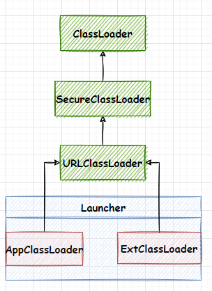
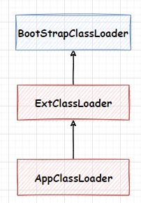
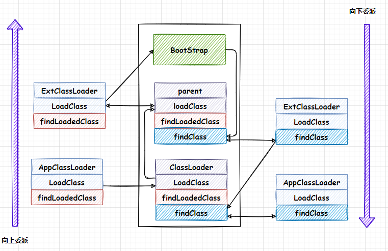
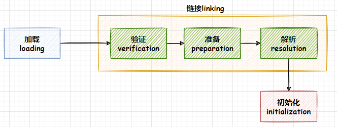

# 类加载器

## 什么是类加载器

​		类加载器的作用负责从磁盘中或者网络中加载class文件，classloader只负责加载class文件，类加载器通过一个类的全限定名来获取描述此类的二进制字节流。类加载器虽然用于实现加载动作，但它在Java程序中起到的作用远远不限于类加载阶段。

​		加载的类信息存放于一个被称为方法区的内存空间。除了类信息之外，方法区还会存运行时常量池信息。可能还包括字符串字面量和数字常量。

​		任意一个类都需要由加载它的类加载器和这个类本身一同确立其在Java虚拟机中的唯一性，意思就是同一个class文件被同一个虚拟机加载但是类加载器不同，这两个类就不相等。这里不相等包括`equals`方法、`inIntance`方法、`isAssignableFrom`方法。

> isAssignableFrom所表示的类或接口是否
>
> 相同，或是否**是其超类或超接口**，单向的。

## 类加载器的种类

JVM有三个自带的类加载器：**Bootstrap ClassLoader**、**Extention ClassLoader**、**Appclass Loader**。除此之外还可以自定义类加载器，自定义的可以直接集成`URLClassLoader`类，可以不用写`findClass`

- **Bootstrap ClassLoader**：启动类加载器，由c++编写是虚拟机的一部分。主要用于加载JAVA_HOME\lib目录下的包，也可以通过`-Xbootclasspath`指定路径
- **Extention ClassLoader**：扩展类加载器，是由Java编写，它负责加载JAVA_HOME\lib\ext目录下的文件，也可以通过`-Djava.ext.dirs`来指定目录。
- **Appclass Loader**：系统类加载器，加载当前应用的classpath的所有类。

## 类加载器的继承体系

`ExtClassLoader`和`AppClassLoader`都是`Launcher`类的静态内部类，`Launcher`类是虚拟机的入口，它是由`BootStrapClassLoader`加载的，在`Launcher`类的构造方法中初始化了`Ext`和`App`两种类型类加载器。

<div align=center></div>

## 双亲委派模型

### 双亲委派模型原理

Java虚拟机加载class文件是按需加载的方式，当需要使用某个类的时候才会将它的class文件加载到内存生成class对象，而加载某个类的class文件时，Java采用的是双亲委派模型，即把请求交给父加载器去处理，是一种任务委派模式。这样避免了类重复加载，保护程序安全，防止核心`api`被随意篡改。

当一个类加载接收到类加载请求，会去缓存中找这个类是否被加载，如果没有就把这个请求委派给它的父加载器去完成，每一层加载器都是如此，所有的加载请求最后都会到达`BootStrap ClassLoader`，如果`BootStrap ClassLoader`的缓存中也没有加载这个类，那它就会从它加载的目录去找着类，如果找到了就加载，否则就回退到子类加载器去对应的目录加载。

普通类的加载器是`AppClassLoader`, `AppClassLoader`的父加载器是`ExtClassLoader`, `ExtClassLoader`的父加载器是`BootstrapClassLoader`。

<div align=center></div>


### 双亲委派模型源码

- 初始化

  `AppClassLoader`和`ExtClassLoader`都是`Launcher`类的内部类，都是在初始化`Launcher`的时候初始化这两个类，先初始化`ExtClassLoader`类，然后把`ExtClassLoader`作为参数传入初始化`AppClassLoader`方法里面，把`ExtClassLoader`类设置为`AppClassLoader`类的父加载器。

  ```java
  /**
   * 初始化类加载器的主要代码
   */
  public Launcher() {
      // 初始化ExtClassLoader
      Launcher.ExtClassLoader var1;
     	var1 = Launcher.ExtClassLoader.getExtClassLoader();
  	// 初始化AppClassLoader并把ExtClassLoader作为父加载器
      this.loader = Launcher.AppClassLoader.getAppClassLoader(var1);
  	// 设置线程上下文类加载器为AppClassLoader
      Thread.currentThread().setContextClassLoader(this.loader);
  }
  ```

- 加载类

加载类主要涉及到三个方法

> loadClass 加载类
>
> findLoadedClass 查找本地缓存是否有请求加载的类
>
> findClass 到对应的目录下取加载类

**`AppClassLoader`**

```java
/**
 *的loadClass方法
 */
public Class<?> loadClass(String name, boolean resolve) {
    // 先从缓存中查找是否加载过该类
    Class<?> c = findLoadedClass(name);
    // 已经加载过此类
    if (c != null) {
        if (resolve) {
            resolveClass(c);
        }
        return c;
    }
    // 如果没有加载过就通过父类的loadClass方法
    return (super.loadClass(name, resolve));
}
```

**`ClassLoader`**

```java
protected Class<?> loadClass(String name, boolean resolve){
    // 先找缓存中有没有加载过该类
    Class<?> c = findLoadedClass(name);
    // 如果没有加载过该类
    if (c == null) {
        // 该加载器的父加载器不为空
        if (parent != null) {
            // 父类去加载类
            c = parent.loadClass(name, false);
        } else {
            // 该类没有父加载器，直接让BootStrapClassLoader去加载类
            c = findBootstrapClassOrNull(name);
        }
		// 如果向上委托到BootStrap都没有找到那么父加载器就从对应的目录中去找
        if (c == null) {
            c = findClass(name);
        }
    }
    // 已经加载过该类
    if (resolve) {
        resolveClass(c);
    }
    return c;
}
```

### 双亲委派模型流程

**向上委派**

> 1.加载器通过findloadedClass去缓存中是否加载过该类
>
> 2.如果没有加载过就委派给父加载器的的loadClass方法
>
> 3.父加载器也会通过findLoadedClass去缓存中查找是否加载过该类，如果没有继续往父加载器的父加载器委派
>
> 4.直到某个加载器没有父加载器，那么就委派给BootStrapClassLoader加载器
>
> 5.BootStrapClassLoader也会去缓存中找，如果没有的话就到BootStrapClassLoader加载目录中查找

**向下委派**

> 1.如果BootStrapClassLoader最后没有找到，就会让委派加载器通过findClass到自己的加载目录中去查找
>
> 2.如果委派的加载器通过findClass在自己的目录没有找到，那么就让向它委派的加载器到自己的目录中查找
>
> 3.这样一级一级向下之后最初的那个加载器，或者中间某一个加载器在自己的目录中找到目标类

<div align=center></div>

# 类加载

## 什么是类加载

​		虚拟机把描述类的数据从class文件加载到内存，并对数据进行校验、转换解析和初始化，最终形成可以被虚拟机直接使用的Java类型，这就是虚拟机的类加载机制。

​		在Java语言中，类型的加载、连接和初始化过程都是在程序运行期间完成的。

## 类的生命周期

​		类从加载到内存开始，到卸载出内存为止，它的整个生命周期包括：加载、验证、准备、解析、初始化、使用、卸载。其中验证、准备、解析三个过程统称为连接。

<div align=center></div>

​		加载、验证、准备、初始化这几个阶段的顺序是确定的，但是解析过程有可能是在初始化之后再开始，这是为了支持Java语言的运行绑定也称为动态绑定。

# 类加载过程

## 加载

加载是类加载过程的第一个步骤，是将class文件读取到计算机内存中。在加载阶段需要做三件事情：

​	1.通过一个类的全限定名来获取定义此类的二进制字节流，也可以从`JAR`包等格式中读取，除此之外还有反射也可以获取一个二进制字节流。

​	2.将这个字节流所代表的静态存储结构转化为方法区的运行时数据结构

​	3.在内存中生成一个代表这个类的`java.lang.Class`对象，作为方法区这个类的各种数据的访问入口

加载完成之后二进制字节流就按照虚拟机所设定的格式存储在方法区之中了，方法区中的数据存储格式完全由虚拟机实现自行定义。类型数据妥善安置在方法区之后，会在Java堆内存中实例化一个`java.lang.Class`类的对象，这个对象将作为程序访问方法区中的类型数据的外部接口。 

## 验证

​		验证阶段会完成四个阶段的验证动作：文件格式验证、元数据验证、字节码验证、符号引用验证。

​		验证阶段对于虚拟机的类加载机制来说，是一个非常重要的、但却不是必须要执行的阶段，因为验证阶段只有通过或者不通过的差别，只要通过了验证，其后就对程序运行期没有任何影响了。在生产环境的实施阶段就可以考虑使用`-Xverify：none`参数来关闭大部分的类验证措施，以缩短虚拟机类加载的时间。

- 文件格式验证

​		文件格式验证主要用于验证字节流是否符合`Class`文件格式的规范，并且能被当前版本的虚拟机处理。

​		该验证阶段的主要目的是保证输入的字节流能正确地解析并存储于方法区之内，格式上符合描述一个`Java`类型信息的要求。

​		这阶段的验证是基于二进制字节流进行的，只有通过了这个阶段的验证之后，这段字节流才被允许进入`Java`虚拟机内存的方法区中进行存储，所以后面的三个验证阶段全部是基于方法区的存储结构上进行的，不会再直接读取、操作字节流了。

- 元数据验证

​		元数据验证是对字节码描述的信息进行语义分析，这个阶段可能包括的验证点如下：这个类是否有父类；这个类的父类是否继承了不允许被继承的类（被`final`修饰的类）；如果这个类不是抽象类，是否实现了其父类或接口之中要求实现的所有方法。 

​		元数据验证的主要目的是对类的元数据信息进行语义校验。

- 字节码验证

​		字节码验证主要通过数据流分析和控制流分析，确定程序语义是合法的、符合逻辑的。在第二阶段对元数据信息中的数据类型校验完毕以后，这阶段就要对类的方法体（`Class`文件中的`Code`属性）进行校验分析。

​		由于数据流分析和控制流分析的高度复杂性，`Java`虚拟机的设计团队为了避免过多的执行时间消耗在字节码验证阶段中，在`JDK 6`之后的`Javac`编译器和`Java`虚拟机里进行了一项联合优化，把尽可能多的校验辅助措施挪到`Javac`编译器里进行。具体做法是给方法体`Code`属性的属性表中新增加了一项名为`StackMapTable`的新属性，这项属性描述了方法体所有的基本块（`Basic Block`，指按照控制流拆分的代码块）开始时本地变量表和操作栈应有的状态，在字节码验证期间，`Java`虚拟机就不需要根据程序推导这些状态的合法性，只需要检查`StackMapTable`属性中的记录是否合法即可。这样就将字节码验证的类型推导转变为类型检查，从而节省了大量校验时间。

​		`JDK 6`的`HotSpot`虚拟机中提供了`-XX：-UseSplitVerifier`选项来关闭掉这项优化，或者使用参数`- XX+FailOverToOldVerifier`要求在类型校验失败的时候退回到旧的类型推导方式进行校验。而到了`JDK 7`之后，尽管虚拟机中仍然保留着类型推导验证器的代码，但是对于主版本号大于50（对应`JDK6`）的`Class`文件，使用类型检查来完成数据流分析校验则是唯一的选择，不允许再退回到原来的类型推导的校验方式。 

- 符号引用验证 

​	最后一个阶段的校验行为发生在虚拟机将符号引用转化为直接引用的时候，这个转化动作将在连接的第三阶段——解析阶段中发生。符号引用验证可以看作是对类自身以外（常量池中的各种符号引用）的各类信息进行匹配性校验，通俗来说就是，该类是否缺少或者被禁止访问它依赖的某些外部类、方法、字段等资源。

## 准备

1.准备阶段是为类变量分配内存并初始化类变量默认值。比如`int`是0，`long`是0L等。

2.这里不包括`final`修饰的`static`，因为`final`在编译的时候就会分配，准备阶段会显示初始化。

3.这里不会为实例变量初始化。

> 如果一个类变量有ConstantValue属性（同时被final和static修饰），在准备阶段就会初始化类变量设置的值，在JDK7及以前类变量是在方法区，从JDK8开始方法区由元空间实现，所以类变量就转移动堆空间了。

## 解析

1.将常量池内的符号引用转换为直接引用的过程。

2.解析通常随着`JVM`在执行完初始化之后再执行。

3.解析动作主要针对类类或接口、字段、类方法、接口方法、方法类型等。对应常量池中的`CONSTANT_Class_info`、`CONSTANT_Fieldref_info`、`CONSTANT_Methodref_info`等

- 符号引用

符号引用以一组符号来描述所引用的目标，符号可以是任何形式的字面量，只要使用时能无歧义地定位到目标即可。符号引用与虚拟机实现的内存布局无关，引用的目标并不一定是已经加载到虚拟机内存当中的内容。各种虚拟机实现的内存布局可以各不相同，但是它们能接受的符号引用必须都是一致的，因为符号引用的字面量形式明确定义在《Java虚拟机规范》的Class文件格式中。 

- 直接引用

直接引用是可以直接指向目标的指针、相对偏移量或者是一个能间接定位到目标的句柄。直接引用是和虚拟机实现的内存布局直接相关的，同一个符号引用在不同虚拟机实例上翻译出来的直接引用一般不会相同。如果有了直接引用，那引用的目标必定已经在虚拟机的内存中存在。 

## 初始化

1.进行准备阶段时，变量已经赋过一次系统要求的初始零值，而在初始化阶段就是执行类构造器`<clinit>()`方法的过程。`<clinit>()`并不是程序员在Java代码中直接编写的方法，它是`Javac`编译器的自动生成物

2.`<clinit>()`方法是由编译器自动收集类中的所有类变量的赋值动作和静态语句块（static{}块）中的语句合并产生的，编译器收集的顺序是由语句在源文件中出现的顺序决定的，静态语句块中只能访问到定义在静态语句块之前的变量，定义在它之后的变量，在前面的静态语句块可以赋值，但是不能访问。

3.`<clinit>()`方法对于类或接口来说并不是必需的，如果一个类中没有静态语句块，也没有对变量的赋值操作，那么编译器可以不为这个类生成`<clinit>()`方法。 

4.接口中不能使用静态语句块，但仍然有变量初始化的赋值操作，因此接口与类一样都会生成`<clinit>()`方法。但接口与类不同的是，执行接口的`<clinit>()`方法不需要先执行父接口的`<clinit>()`方法，因为只有当父接口中定义的变量被使用时，父接口才会被初始化。此外，接口的实现类在初始化时也一样不会执行接口的`<clinit>()`方法。 

5.Java虚拟机必须保证一个类的`<clinit>()`方法在多线程环境中被正确地加锁同步，如果多个线程同时去初始化一个类，那么只会有其中一个线程去执行这个类的`<clinit>()`方法，其他线程都需要阻塞等待，直到活动线程执行完毕`<clinit>()`方法。如果在一个类的`<clinit>()`方法中有耗时很长的操作，那就可能造成多个进程阻塞，需要注意，其他线程虽然会被阻塞，但如果执行`＜clinit＞()`方法的那条线程退出`＜clinit＞()`方法后，其他线程唤醒后则不会再次进入`＜clinit＞()`方法。同一个类加载器下，一个类型只会被初始化一 次。

