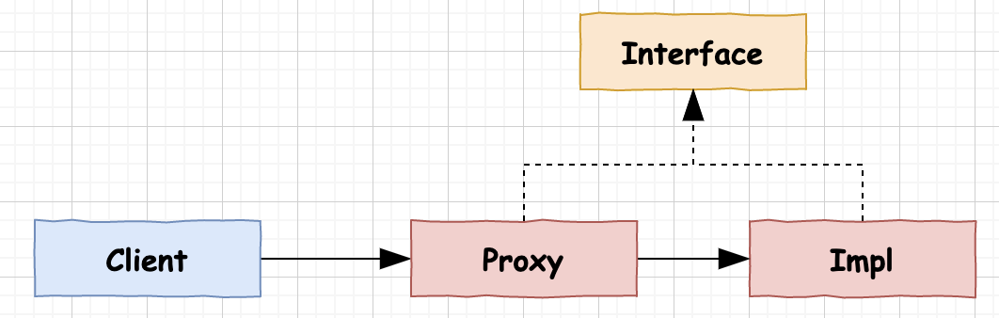
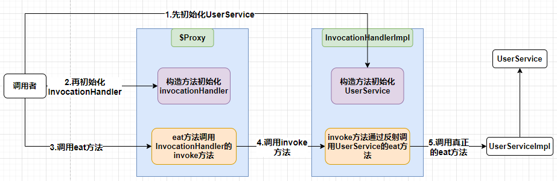

# 代理模式

## 代理模式介绍
代理模式就是某一个类需要访问一个目标类，不是通过直接访问的方式，而是先访问一个中间类，再由这个中间类去访问目标类。代理模式一般用于保护目标类，或者增强目标类。

## 代理模式类图

interface是顶层接口，proxy是代理类，Impl是目标类，client通过访问proxy进而访问到真正的Impl。



## 代理模式的优缺点

- 优点

1.代理模式能的能保护目标类的实现细节。
2.增强目标对类，可以不修改目标类的情况下在代理类中添加一些其他实现。
3.降低了目标类和调用类之间的耦合。

- 缺点

1.代理模式会造成系统设计中类的数目的增加。
2.在客户端和目标对象增加一个代理对象，会造成请求处理速度变慢
3.增加了系统的复杂度。

# JDK代理分类

- 静态代理
- JDK动态代理

# JDK静态代理

## 静态代理

静态代理的目标类和代理类需要实现同一接口。

优点：静态代理可以做到在不修改目标类的前提下，对目标类的功能进行扩展。

缺点：但是这种方式会导致多一些接口，并且接口增加了方法，目标类和代理类都需要修改。

## 示例代码

- 接口

```java
public interface UserService {
    void eat();
}
```

- 目标类

```java
public class UserServiceImpl implements UserService{
    @Override
    public void eat() {
        System.out.println("eat");
    }
}
```

- 代理类

```java
public class ProxyImpl implements UserService{
    private UserService userService;
    public ProxyImpl(UserService userService) {
        this.userService = userService;
    }
    @Override
    public void eat() {
        System.out.println("吃饭之前");
        userService.eat();
        System.out.println("吃饭之后");
    }
}
```

- 调用者

```java
public class Demo {
    public static void main(String[] args) {
        UserService userService = new UserServiceImpl();
        ProxyImpl proxyImpl = new ProxyImpl(userService);
        proxyImpl.eat();
    }
}
```

# JDK动态代理

## 动态代理

在`java`的`java.lang.reflect`包下面有一个`InvocationHandler`接口和动态代理类`Proxy`，用来实现`jdk`的动态代理。

## 示例代码

- 接口

```java
public interface UserService {
    void sleep();
    void eat();
}
```

- 实现类

```java
public class UserServiceImpl implements UserService {
    @Override
    public void sleep() {
        System.out.println("sleep");
    }
    @Override
    public void eat() {
        System.out.println("eat");
    }
}
```

- 处理器类

```java
public class InvocationHandlerImpl implements InvocationHandler {

    /**
     * 要代理的真实对象
     */
    private Object target;

    public InvocationHandlerImpl(Object target) {
        this.target = target;
    }

    /**
     *
     * 该方法负责处理动态代理类上的所有方法调用
     * 调用处理器根据这三个参数进行预处理或分派到委托实例上反射执行
     * @param proxy 代理类实例
     * @param method 被调用的方法
     * @param args 调用参数
     * @return 返回值
     * @throws Throwable 异常
     */
    @Override
    public Object invoke(Object proxy, Method method, Object[] args) throws Throwable {
        System.out.println("方法"+ method.getName() +"调用前");
        Object returnValue = method.invoke(target, args);
        System.out.println("方法"+ method.getName() +"调用后");
        return returnValue;
    }
}
```

- 调用者

```java
public class Demo {
    public static void main(String[] args) {
        UserService userService = new UserServiceImpl();
        InvocationHandler invocationHandler = new InvocationHandlerImpl(userService);
        UserService userService1 = (UserService)Proxy
                .newProxyInstance(userService.getClass().getClassLoader(), userService.getClass().getInterfaces(), invocationHandler);
        /*
         * newProxyInstance 返回一个$Proxy0类，该类继承了Proxy类，实现了UserService接口
         * 实现了Userservice接口的方法，是调用了InvocationHandler的invoke方法
         * 并且把 UserServiceImpl 的Method穿个InvocationHandler的invoke方法
         */
        userService1.sleep();
        userService1.eat();
    }
}
```

## InvocationHandler

`InvocationHandler`是一个接口，该接口中只有一个方法`invoke`。在该方法内可以实现一些代理类需要做的事情，比如日志处理，权限判断等等。

```java
public interface InvocationHandler {
    
    /**
     *
     * @param proxy 代理类
     * @param method 被代理类的方法
     * @param args 被代理类的方法的参数
     */
    public Object invoke(Object proxy, Method method, Object[] args)
        throws Throwable;
}
```

## Proxy

### Porxy

`Proxy`是动态代理类，负责代码在执行过程中通过调用`newProxyInstance`动态生成一个代理对象。这个代理对象继承了`Proxy`类并且和被代理类实现了同样的接口。

```java
/**
  *
  * 删掉一些异常处理等代码
  *
  * @param var0 被代理类的类加载器
  * @param var1 被代理类的方法集合
  * @param var2 InvocationHandler接口的实现类
  */
public static Object newProxyInstance(ClassLoader var0, Class<?>[] var1, InvocationHandler var2)  {
        Objects.requireNonNull(var2);
        Class[] var3 = (Class[])var1.clone();
        // 生成代理类的Class
        Class var5 = getProxyClass0(var0, var3);
				
  		// 获取代理类的构造方法
        final Constructor var6 = var5.getConstructor(constructorParams);
        if (!Modifier.isPublic(var5.getModifiers())) {
          AccessController.doPrivileged(new PrivilegedAction<Void>() {
            public Void run() {
              var6.setAccessible(true);
              return null;
            }
          });
        }
  		// 反射生成代理类对象
        return var6.newInstance(var2);
    }
```

### $Proxy

`Proxy`的`newProxyInstance`方法会生成一个`$Proxy`类，通过这个类再生成代理对象。在调用`newProxyInstance`方法之前调用方法`System.getProperties().put("sun.misc.ProxyGenerator.saveGeneratedFiles", "true")`就会在根目录下生成`$Proxy`类。（不同版本的jdk调用的方法不一样，具体可以看`ProxyGenerator`类里面的`saveGeneratedFiles`字段后面的字符串）

`$Proxy`继承了`Proxy`类并且和被代理类实现了同样的接口。`$Proxy`有一个构造方法，只有一个参数就是`InvocationHandler`接口，还有一些`Method`字段，一般前三个是不变的主要是`toString`、`equals`、`hashCode`后面的`Method`是实现的接口的`Method`。

`$Proxy`中实现的代理接口的方法，并且调用`InvocationHandler`的`invoke`方法，将被代理的一些信息传给`invoke`方法。

```java
//
// Source code recreated from a .class file by IntelliJ IDEA
// (powered by Fernflower decompiler)
//

package com.sun.proxy;

import com.lee.study.aop.dynamic.UserService;
import java.lang.reflect.InvocationHandler;
import java.lang.reflect.Method;
import java.lang.reflect.Proxy;
import java.lang.reflect.UndeclaredThrowableException;

public final class $Proxy0 extends Proxy implements UserService {
    private static Method m1;
    private static Method m4;
    private static Method m2;
    private static Method m3;
    private static Method m0;

    public $Proxy0(InvocationHandler var1) throws  {
        super(var1);
    }

    public final boolean equals(Object var1) throws  {
        try {
            return (Boolean)super.h.invoke(this, m1, new Object[]{var1});
        } catch (RuntimeException | Error var3) {
            throw var3;
        } catch (Throwable var4) {
            throw new UndeclaredThrowableException(var4);
        }
    }

    public final void eat() throws  {
        try {
            super.h.invoke(this, m4, (Object[])null);
        } catch (RuntimeException | Error var2) {
            throw var2;
        } catch (Throwable var3) {
            throw new UndeclaredThrowableException(var3);
        }
    }

    public final String toString() throws  {
        try {
            return (String)super.h.invoke(this, m2, (Object[])null);
        } catch (RuntimeException | Error var2) {
            throw var2;
        } catch (Throwable var3) {
            throw new UndeclaredThrowableException(var3);
        }
    }

    public final void sleep() throws  {
        try {
            super.h.invoke(this, m3, (Object[])null);
        } catch (RuntimeException | Error var2) {
            throw var2;
        } catch (Throwable var3) {
            throw new UndeclaredThrowableException(var3);
        }
    }

    public final int hashCode() throws  {
        try {
            return (Integer)super.h.invoke(this, m0, (Object[])null);
        } catch (RuntimeException | Error var2) {
            throw var2;
        } catch (Throwable var3) {
            throw new UndeclaredThrowableException(var3);
        }
    }

    static {
        try {
            m1 = Class.forName("java.lang.Object").getMethod("equals", Class.forName("java.lang.Object"));
            m4 = Class.forName("com.lee.study.aop.dynamic.UserService").getMethod("eat");
            m2 = Class.forName("java.lang.Object").getMethod("toString");
            m3 = Class.forName("com.lee.study.aop.dynamic.UserService").getMethod("sleep");
            m0 = Class.forName("java.lang.Object").getMethod("hashCode");
        } catch (NoSuchMethodException var2) {
            throw new NoSuchMethodError(var2.getMessage());
        } catch (ClassNotFoundException var3) {
            throw new NoClassDefFoundError(var3.getMessage());
        }
    }
}
```

## 动态代理流程



1.首先初始化`UserService`，然后将初始化的`Userservice`作为参数传给`InvocationHandler`的构造方法

2.初始化`InvocationHandler`，并且将初始化了的`InvocationHandler`作为参数传递给`$Proxy`的构造方法

3.调用调用`$Proxy`的`eat`方法

4.在`$Proyx`的`eat`方法里面掉用了`InvocationHandler`的`invoke`方法

5.在`InvocationHandler`的`invoke` 方法里面通过反射调用了真正的`eat`方法，并且可以在`invoke`方法内调用`eat`方法前后做一些业务相关的操作。

# CGLIB

## 什么是CGLIB

`CGLIB(Code Generation Library)`是一个开源项目，是一个强大的、高性能、高质量的`Code`生成类库，它可以在运行期间扩展`Java`类与实现`Java`接口，弥补了JDK动态代理只能代理接口的局限性。

`CGLIB`代理使用ASM框架直接对字节码进行操作（编译期），在类的执行过程中比较高效。Java动态代理使用Java原生的反射API进行操作（运行期），在生成类上比较高效。

## 示例代码

要使用`CGLIB`首先需要引入`CGLIB`包

```xml
<dependency>
    <groupId>cglib</groupId>
    <artifactId>cglib</artifactId>
    <version>3.3.0</version>
</dependency>
```

- 被代理类

```java 
public class UserService {
    public void eat() {
        System.out.println("eat");
    }
}
```

- 调用

```java
public class Demo {
    public static void main(String[] args) {
        Enhancer enhancer = new Enhancer();
        enhancer.setSuperclass(UserService.class);
        enhancer.setCallback(new MethodInterceptor() {
            @Override
            public Object intercept(Object o, Method method, Object[] objects, MethodProxy methodProxy) throws Throwable {
                System.out.println("eat before");
                Object result = methodProxy.invokeSuper(o, objects);
                System.out.println("eat after");
                return result;
            }
        });
        UserService userService = (UserService) enhancer.create();
        userService.eat();
    }
}
```

## CGLIB基本结构

cglib代码包的结构包括一下几个部分

- beans：bean操作类
- core：核心代码
- proxy：代理的创建和方法的拦截
- reflect
- transform
- util

## enhancer

`Enhancer`是`CGLIB`中最常用的一个类，相当于`JDK`动态代理中的`Proxy`，既能够代理普通的类也能够代理接口。`Enhancerch`创建一个被代理对象的子类并且拦截所有的方法调用，包括从Object中继承的toString和hashCode方法，但是不能够拦截final类与方法。所以Hibernate不能持久化final class的原因。

## 增强

```java
Enhancer.setCallback(Callback callback);

Enhancer.setCallback(new InvocationHandler() {});

Enhanceer.setCallback(new MethodInterceptor(){});
```

## 创建增强对象

```java
Enhancer.create();
Enhancer.create(Class type, Callback callback);
Enhancer.create(Class superClass, Class[] interfaces, Callback callback);
Enhancer.create(Class[] argumentTypes, Object[] arguments);
```

## Callback

Callback是一个空的接口，在CGLIB中主要有以下几个子接口

- MethodInterceptor
- NoOp
- LazyLoader
- Dispatcher
- InvocationHandler
- FixedValue

### MethodInterceptor

它可以类似于AOP的环绕增强


在Spring的AOP编程中:

如果加入容器的目标对象有实现接口,用JDK代理

如果目标对象没有实现接口,用Cglib代理。