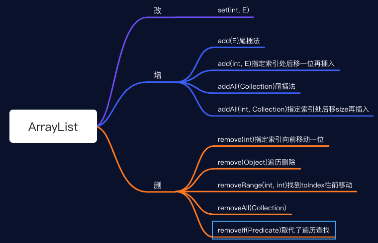

# ArrayList

## 内部类

### Itr

Itr实现了Iterator迭代器接口，用于遍历集合的类。在1.8中新增了一个forEachRemaining方法。和hasNext一样，同一个Iterator对象不能用两次，因为每次遍历之后指针都会指到最后一个位置。

```java
private class Itr implements Iterator<E> {
  public E next();
  public boolean hasNext();
  public void remove();
  public void forEachRemaining(Consumer<? super E> consumer);
}
```

### ListItr

ListItr继承了Itr并且实现ListIterator接口，是对Itr的一个升级。可以从任意位置开始往前或者往后遍历，不仅可以删除元素还可以新增或者修改元素。

```java
private class ListItr extends Itr implements ListIterator<E> {
  ListItr(int index);
  public boolean hasPrevious();
  public int nextIndex();
  public int previousIndex(); 
  public E previous();
  public void set(E e);
  public void add(E e);
}
```

### SubList

SubList是一个内部类，用于截取List的一部分元素。这个类并不能强制转换为AraryList

```java
private class SubList extends AbstractList<E> implements RandomAccess {}
```

### ArrayListSpliterator 

ArrayListSpliterator implements Spliterator 迭代分割器，对并行能力大大的增强，Spliterator就是为了并行遍历元素而设计的一个迭代器，
在1.8中的集合都默认实现了Spliterator

暂时略

## 变量

```java
/**
 * 默认初始容量
 */
DEFAULT_CAPACITY = 10;

/**
 * 用于有参构造函数当初始容量为0时赋值
 */
Object[] EMPTY_ELEMENTDATA = {}

/**
 * 无参构造函数赋值用
 */
Object[] DEFAULTCAPACITY_EMPTY_ELEMENTDATA = {}

/**
 * 存放数据的数组，transient修饰是不可序列化的
 * 那么在反序列化之后也不会丢失原来的数据元素，ArrayList会自定义在序列化，在序列化的的时候会调用
 * writeObject，反序列化的时候调用readObject，因为ArrayList的elementData数组中有未使用的空间，如果没有
 * 的空间也被序列化了会影响性能
 */
transient Object[] elementData;

/**
 * 集合大小
 */
int size
```

## 构造方法

### 空构造方法

```java
// 空构造方法
public ArrayList() {
  this.elementData = DEFAULTCAPACITY_EMPTY_ELEMENTDATA;
}
```

### 指定初始大小构造方法

```java
public ArrayList(int initialCapacity) {
  if (initialCapacity > 0) {
    this.elementData = new Object[initialCapacity];
  } else if (initialCapacity == 0) {
    this.elementData = EMPTY_ELEMENTDATA;
  } else {
    throw new IllegalArgumentException("Illegal Capacity: "+initialCapacity);
  }
}
```

### 指定集合构造方法

为什么这`toArray`是调用了`Arrays.copyOf`,还要判断一下是不是`Object.class`再转换一次。

因为传入的集合类型可能重写`toArray()`方法，返回的类型可能不是`Object[].class`，也可能返回的是`String[].class`。所以这里进行一个判断，如果是不是`Object[].class`就需要通过`Arrays.copyOf`方法进行转换一次。

```java
public ArrayList(Collection<? extends E> c) {
  // 将集合转换为数组
  elementData = c.toArray();
  if ((size = elementData.length) != 0) {
    if (elementData.getClass() != Object[].class)
      elementData = Arrays.copyOf(elementData, size, Object[].class);
  } else {
    // replace with empty array.
    this.elementData = EMPTY_ELEMENTDATA;
  }
}
```

## 扩容机制

ArrayList在添加元素前都会进行数组的容量大小判断，下面的方法就是扩容的时候依次操作。

```java
ensureCapacityInternal(size + 1);

private void ensureCapacityInternal(int minCapacity) {
  ensureExplicitCapacity(calculateCapacity(elementData, minCapacity));
}

/**
 * 1.空构造
 * 		a.如果数组是空数组，那么返回默认容量10
 * 		b.如果数组是有元素，那么返回size+1
 * 2.非空构造
 * 		a.返回size+1
 */
private static int calculateCapacity(Object[] elementData, int minCapacity) {
  if (elementData == DEFAULTCAPACITY_EMPTY_ELEMENTDATA) {
    return Math.max(DEFAULT_CAPACITY, minCapacity);
  }
  return minCapacity;
}

/**
 * 	如果是空构造，并且第一次添加元素，进行扩容操作
 *	如果是非空构造，并且集合size+1 大于数组容量就进行扩容操作
 */
private void ensureExplicitCapacity(int minCapacity) {
  modCount++;

  // overflow-conscious code
  if (minCapacity - elementData.length > 0)
    grow(minCapacity);
}

/**
 * 扩容操作
 */
private void grow(int minCapacity) {
  // 原始容量，就是数组的大小
  int oldCapacity = elementData.length;
  // 扩容后的容量大小，原始容量+原始容量的一半，也就是1.5倍
  int newCapacity = oldCapacity + (oldCapacity >> 1);
  // 如果新的容量比集合size+1小，那么集合容量就是size+1
  if (newCapacity - minCapacity < 0)
    newCapacity = minCapacity;
  // 如果新的容量 比int最大值-8还大
  // 如果集合size+1比int最大值-8还大，新容量就是int最大值，如果集合size+1比int最大值-8小，新容量就是int
  // 最大值-8
  if (newCapacity - MAX_ARRAY_SIZE > 0)
    newCapacity = hugeCapacity(minCapacity);
  // 扩容操作
  elementData = Arrays.copyOf(elementData, newCapacity);
}

/**
 * 如果集合size+1 比int最大值-8 还大，那么就返回int最大值，否则就返回int最大值-8
 */
 private static int hugeCapacity(int minCapacity) {
   if (minCapacity < 0) // overflow
     throw new OutOfMemoryError();
   return (minCapacity > MAX_ARRAY_SIZE) ?
     Integer.MAX_VALUE :
   MAX_ARRAY_SIZE;
 }
```

## 基本方法




