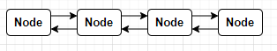
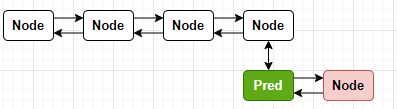
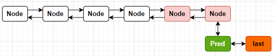

# LinkedList

## 底层数据结构

`LinkedList`底层是采用的一个双向链表，每一个元素都被封装成一个内部类`Node`。因为LinkedList实现了Deque所以也具备了队列的基本方法。

## 内部类

### ListItr

`ListItr`和`ArrayList`的`ListItr`类似都是用于从任意位置遍历元素。

### Node

`Node`是用于封装添加进LinkedList的元素的一个内部类。

```java
private static class Node<E> {
    E item;
    Node<E> next;
    Node<E> prev;

    Node(Node<E> prev, E element, Node<E> next) {
        this.item = element;
        this.next = next;
        this.prev = prev;
    }
}
```

### DescendingIterator

也是用于遍历元素，不过是倒叙遍历，注意如果这个是LinkedList内部的一个类，并且是属于Deque队列中的一个方法不属于List。

```java
private class DescendingIterator implements Iterator<E> {
    // 通过迭代器，从最后一个索引出开始遍历
    private final ListItr itr = new ListItr(size());
    public boolean hasNext() {
        return itr.hasPrevious();
    }
    public E next() {
        return itr.previous();
    }
    public void remove() {
        itr.remove();
    }
}
```

### LLSpliterator

暂时略

## 变量

```java
// 集合大小
transient int size = 0;
// 第一个元素
transient Node<E> first;
// 最后一个元素
transient Node<E> last;
```
## 构造方法
### 空构造
```java
public LinkedList() {
}
```
### 指定集合构造
```java
public LinkedList(Collection<? extends E> c) {
    this();
    addAll(c);
}
```

## 基本方法

### 添加元素

LinkedList添加元素主要有如下几个方法，真正实现添加逻辑的有三个方法：`linkLast`；`addAll`；`linkFirst`。

| 方法                    | 调用链      | 实际逻辑                |
| ----------------------- | ----------- | ----------------------- |
| add(E)                  |             | linkLast(e)             |
| offer(E)                | add(e)      | linkLast(e)             |
| offerLast(E)            | addLast(e)  | linkLast(e)             |
| push(E)                 | addFirst(e) | linkFirst(e)            |
| offerFirst(E)           | addFirst(e) | linkFirst(e)            |
| addAll(Collection)      |             | addAll(int, Collection) |
| addAll(int, Collection) |             |                         |

### linkLast

```java
 void linkLast(E e) {
     // l指向最后一个元素
     final Node<E> l = last;
     // 新添加的元素封装成一个Node对象
     final Node<E> newNode = new Node<>(l, e, null);
     // last指向新元素
     last = newNode;
     // 如果最后一个元素为空，那么第一个first也指向新元素
     if (l == null)
         first = newNode;
     else
         // 如果最后一个元素不是空，那么最后一个元素的next就是新元素
         l.next = newNode;
     size++;
     modCount++;
 }
```

### linkFirst

```java
private void linkFirst(E e) {
    // f指向第一个元素
    final Node<E> f = first;
    // 新添加的元素封装成一个Node对象
    final Node<E> newNode = new Node<>(null, e, f);
    // first指向新元素
    first = newNode;
    // 如果第一个元素为空，那么last也指向新元素
    if (f == null)
        last = newNode;
    else
        // 如果第一个元素不为空，第一个元素的prev就是新元素
        f.prev = newNode;
    size++;
    modCount++;
}
```

### addAll

```java
public boolean addAll(int index, Collection<? extends E> c) {
    // 将要插入的集合转换为数组
    Object[] a = c.toArray();
    // 如果是空数组就返回
    int numNew = a.length;
    if (numNew == 0)
        return false;
	
    Node<E> pred, succ;
    // 插入到末尾，pred指向最后一个元素
    if (index == size) {
        succ = null;
        pred = last;
    } else {
        // 插入到中间，succ就指向需要插入位置的元素
        // pred就指向插入位置元素的前一个元素
        succ = node(index);
        pred = succ.prev;
    }

    // 循环将新加的集合插入到链表上
    for (Object o : a) {
        @SuppressWarnings("unchecked") E e = (E) o;
        Node<E> newNode = new Node<>(pred, e, null);
        if (pred == null)
            first = newNode;
        else
            pred.next = newNode;
        pred = newNode;
    }

   
    if (succ == null) {
        // 如果是插入到末尾，那么last指向pred也就是最后一个元素
        last = pred;
    } else {
        // 如果不是插入到末尾，那么将插入的集合的最后一个元素指向succ
        // succ指向插入集合的最后一元素
        pred.next = succ;
        succ.prev = pred;
    }

    size += numNew;
    modCount++;
    return true;
}

/**
 * 查找插入数据的节点，首先判断索引是小于集合size的一半
 * 如果是小于集合size的一半就从第一个节点查找
 * 如果是大于集合size的一半就从最后一个节点查找
 */
Node<E> node(int index) {
    if (index < (size >> 1)) {
        Node<E> x = first;
        for (int i = 0; i < index; i++)
            x = x.next;
        return x;
    } else {
        Node<E> x = last;
        for (int i = size - 1; i > index; i--)
            x = x.prev;
        return x;
    }
}
```

#### 插入元素到末尾

- 原始集合



- 将pred指向最后一个元素


- 封装一个Node节点，并且这个节点的prev已经执行pred


- 遍历集合，将pred的next指向新增的Node节点



- 每次循环最后，将pred指向最后一个元素


- 循环结束后，所有元素都已经链接到链表上了


- 将last指向最后一个元素



#### 插入元素到任意位置

- 原始集合

  

- 找到需要插入元素的位置，并用succ指向该节点，pred指向该节点的前一个节点


- 将新元素封装成一个Node并将prev指向pred


- 将pred的next指向这个新的Node


- 循环将插入的集合链接到链表上


- 最后将pred的next指向succ，将succ的prev指向pred


- 将last指向最后一个元素


