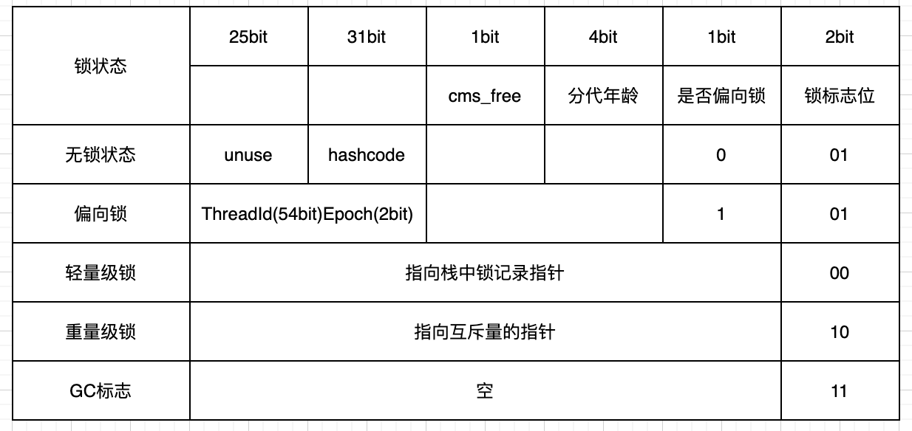

# 线程同步

## 线程安全

在`Java`多线程环境下，当多个线程共同操作共享资源的情况下，会产生线程安全问题。为了解决这样的问题我们需要保证同一时刻只有一个线程在操作共享资源，其他线程必须等到该线程释放对共享资源的占用。

## 什么是线程同步

为了解决线程安全问题而采取的措施叫做线程同步，线程同步主要是解决三个问题：原子性、可见性、有序性。

- 原子性：一个或多个操作要不全部执行，要么不执行，具有原子性同一时刻只能有一个线程执行
- 可见性：当多个线程访问一个变量的时候，一个线程修改了变量的值，其它的线程立马就可以看到
- 有序性：程序的执行按照代码的先后顺序执行，`Java`内存模型，为了提高效率允许编译器和处理器对指令重排序

## 线程同步方法

- synchronized
- volatile
- Lock
- ThreadLocal
- 阻塞队列
- 原子类

# synchronized

## 简介

`synchronize`是`Java`中的关键字，可以用在普通方法、静态方法、同步代码块。

`synchronize`解决了：原子性、可见性、有序性三个问题。

## 使用案例

### 修饰普通方法

`synchronized`修饰普通方法只需要在方法上加上`synchronized`即可。`synchronized`修饰的方法，如果子类重写了这个方法，子类也必须加上`synchronized`关键字才能达到线程同步的效果。

```java
public class ThreadDemo extends Thread{
    private static int i = 0;
    @Override
    public void run() {
        this.method();
    }
    public synchronized void method() {
        i++;
    }
    public static void main(String[] args) {
        ThreadDemo demo = new ThreadDemo();
        Thread t1 = new Thread(demo);
        Thread t2 = new Thread(demo);
        t1.start();
        t2.start();
    }
}
```

### 修饰静态方法

当`synchronized`作用于静态方法时，其锁就是当前类的`class`锁，由于静态成员不专属任何一个实例对象，是类成员成员，因此通过`class`锁可以控制静态成员的并发操作，如果一个线程A调用一个实例对象的非`static synchronized`方法，而线程B需要调用这个实例对象所属类的静态`synchronized`方法，是允许的，不会发生互斥现象。

```java
public class ThreadDemo extends Thread{
    private static int i = 0;
    @Override
    public void run() {
        for (int i = 0; i < 10000; i++) {
            method();
        }

    }
    public static synchronized void method() {
        i++;
    }
    public static void main(String[] args) throws InterruptedException{
        ThreadDemo demo1 = new ThreadDemo();
        ThreadDemo demo2 = new ThreadDemo();
        Thread t1 = new Thread(demo1);
        Thread t2 = new Thread(demo2);
        t1.start();
        t2.start();
        //主线程等待，直到子线程结束
        t1.join();t2.join();
        //the result is: 20000
        System.out.println("the result is: " + i);
    }
}
```

### 修饰同步代码块

修饰同步代码块可以使用：类对象和实例对象，但是要保证唯一性，多个线程使用的对象要是同一个对象。

`static`修饰的是类变量，只有一个，所以这里虽然创建了两个对象但是`object`只有一个，所这里的锁是有用的，如果去掉`object`变量去掉`static`修饰符，那么这个锁就失去了效果。同理这里用`Thread.class`的效果也是和静态变量一致。

```java
public class ThreadDemo extends Thread{
    private static Object object = new Object();
    private static int i = 0;
    @Override
    public void run() {
        for (int j = 0; j < 10000; j++) {
            synchronized (object) {//ThreadDemo.class
                i++;
            }
        }
    }

    public static void main(String[] args) throws InterruptedException{
        ThreadDemo demo1 = new ThreadDemo();
        ThreadDemo demo2 = new ThreadDemo();
        Thread t1 = new Thread(demo1);
        Thread t2 = new Thread(demo2);
        t1.start();
        t2.start();
        //主线程等待，直到子线程结束
        t1.join();t2.join();
        System.out.println(i);
    }
}
```

## synchronized原理

`synchronized`是借助`Java`对象头来实现的，当多个线程抢占共享资源是都要先获取`Java`对象锁，当一个线程获取到对象锁之后，其它线程只能处于等待的状态。

- 同步方法：同步方法是通过常量池中的`ACC_SYNCHRONIZED`访问标识来区分一个方法是否需要同步，如果有这个标识，执行方法的时候会先去获取对象锁，方法执行完毕之后会释放对象锁。
- 同步代码块：同步代码块是通过`monitorenter`和`monitorexit`指令，其中`monitorenter`指令指向同步代码块的开始位置，`monitorexit`指令则指明同步代码块的结束位置，当执行`monitorenter`指令的时候需要去获取对象锁，执行`monitorexit`的时候释放对象锁。

## 对象实现锁过程

### 对象头

对象头是实现`synchronized`的基础，`Java`对象在堆内存的分了三个部分：

- 对象头
- 实例数据
- 填充数据

对象头又分为了两部分，其中标记字段主要存储`GC`分代信息、锁信息等：

- 标记字段`Mark Word`
- 类型指针`Klass Pointer`

> 查看对象头可以使用：jol-core 包

对象头在64位虚拟机下的结构：



### 重量级锁

每个`Java`对象都可以关联一个`Monitor`，重量级锁对象头的`Mark Word`就指向`MOnitor`对象指针。

`Monitor`实现锁的流程参考[Java Monitor机制]()

### 轻量级锁

- 加锁过程
  - 在即将进入同步代码块的时候，如果此同步对象没有被锁定，锁标志位01，是否偏向锁为0
  - 虚拟机在当前线程的栈帧中建立一个名为锁记录`Lock Record`的空间，用于存储锁对象目前的`Mark Word`的拷贝，官方称为`Displaced Mark Word`。
  - 虚拟机使用`CAS`操作尝试把对象的`Mark Word`更新为指向`Lock Record`的指针
  - 如果更新成功则表示该线程拥有了对象的锁，锁标志位变为00
  - 如果更新失败，虚拟机会检查对象的`Mark Word`是否指向当前线程的栈帧，如果是则继续执行，如果不是则膨胀为重量级锁，锁标志位变成10。
- 解锁过程
  - 用`CAS`操作把对象当前的`Mark Word`和线程中复制的`Displaced Mark Word`替换回来
  - 如果替换成功，同步过程就完成了
  - 如果替换不成功，说明有其它线程尝试获取该锁，就要在释放锁的同时，唤醒被挂起的线程

### 偏向锁

是为了优化轻量级锁在无竞争的情况下使用`CAS`操作。

- 加锁过程

  当锁对象第一次被线程获取的时候，虚拟机将会把对象头中的标志位设置为01，把偏向模式设置为1，表示进入偏向模式。同时使用`CAS`操作把获取到这个锁的线程的`ID`记录在对象的`Mark Word`之中。如果操作成功，持有偏向锁的线程以后每次进入这个锁相关的同步块时，虚拟机都可以不再进行任何同步操作。

- 解锁过程

  一旦出现另外一个线程去尝试获取这个锁的情况，偏向锁结束，撤销后恢复到未锁定或者轻量级锁定状态。

  因为偏向锁记录的是线程的`id`，那么如果对象调用了`hashcode`方法会导致偏向锁被撤销，轻量级锁会在锁记录`hashcode`，重量级锁会在`Monitor`中记录`hashcode`
