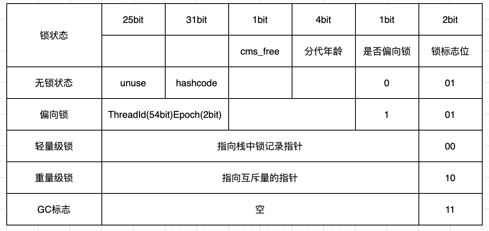

# 线程同步

## 线程安全

在`Java`多线程环境下，当多个线程共同操作共享资源的情况下，会产生线程安全问题。为了解决这样的问题我们需要保证同一时刻只有一个线程在操作共享资源，其他线程必须等到该线程释放对共享资源的占用。

## 什么是线程同步

为了解决线程安全问题而采取的措施叫做线程同步，线程同步主要是解决三个问题：原子性、可见性、有序性。

- 原子性：一个或多个操作要不全部执行，要么不执行，具有原子性同一时刻只能有一个线程执行
- 可见性：当多个线程访问一个变量的时候，一个线程修改了变量的值，其它的线程立马就可以看到
- 有序性：程序的执行按照代码的先后顺序执行，`Java`内存模型，为了提高效率允许编译器和处理器对指令重排序

## 线程同步方法

- synchronized
- volatile
- Lock
- ThreadLocal
- 阻塞队列
- 原子类

# synchronized

## 简介

`synchronize`是`Java`中的关键字，可以用在普通方法、静态方法、同步代码块。

`synchronize`解决了：原子性、可见性、有序性三个问题。

## 使用案例

### 修饰普通方法

`synchronized`修饰普通方法只需要在方法上加上`synchronized`即可。`synchronized`修饰的方法，如果子类重写了这个方法，子类也必须加上`synchronized`关键字才能达到线程同步的效果。

```java
public class ThreadDemo extends Thread{
    private static int i = 0;
    @Override
    public void run() {
        this.method();
    }
    public synchronized void method() {
        i++;
    }
    public static void main(String[] args) {
        ThreadDemo demo = new ThreadDemo();
        Thread t1 = new Thread(demo);
        Thread t2 = new Thread(demo);
        t1.start();
        t2.start();
    }
}
```

### 修饰静态方法

当`synchronized`作用于静态方法时，其锁就是当前类的`class`锁，由于静态成员不专属任何一个实例对象，是类成员成员，因此通过`class`锁可以控制静态成员的并发操作，如果一个线程A调用一个实例对象的非`static synchronized`方法，而线程B需要调用这个实例对象所属类的静态`synchronized`方法，是允许的，不会发生互斥现象。

```java
public class ThreadDemo extends Thread{
    private static int i = 0;
    @Override
    public void run() {
        for (int i = 0; i < 10000; i++) {
            method();
        }

    }
    public static synchronized void method() {
        i++;
    }
    public static void main(String[] args) throws InterruptedException{
        ThreadDemo demo1 = new ThreadDemo();
        ThreadDemo demo2 = new ThreadDemo();
        Thread t1 = new Thread(demo1);
        Thread t2 = new Thread(demo2);
        t1.start();
        t2.start();
        //主线程等待，直到子线程结束
        t1.join();t2.join();
        //the result is: 20000
        System.out.println("the result is: " + i);
    }
}
```

### 修饰同步代码块

修饰同步代码块可以使用：类对象和实例对象，但是要保证唯一性，多个线程使用的对象要是同一个对象。

`static`修饰的是类变量，只有一个，所以这里虽然创建了两个对象但是`object`只有一个，所这里的锁是有用的，如果去掉`object`变量去掉`static`修饰符，那么这个锁就失去了效果。同理这里用`Thread.class`的效果也是和静态变量一致。

```java
public class ThreadDemo extends Thread{
    private static Object object = new Object();
    private static int i = 0;
    @Override
    public void run() {
        for (int j = 0; j < 10000; j++) {
            synchronized (object) {//ThreadDemo.class
                i++;
            }
        }
    }

    public static void main(String[] args) throws InterruptedException{
        ThreadDemo demo1 = new ThreadDemo();
        ThreadDemo demo2 = new ThreadDemo();
        Thread t1 = new Thread(demo1);
        Thread t2 = new Thread(demo2);
        t1.start();
        t2.start();
        //主线程等待，直到子线程结束
        t1.join();t2.join();
        System.out.println(i);
    }
}
```

## synchronized原理

`synchronized`是借助`Java`对象头来实现的，当多个线程抢占共享资源是都要先获取`Java`对象锁，当一个线程获取到对象锁之后，其它线程只能处于等待的状态。

- 同步方法：同步方法是通过常量池中的`ACC_SYNCHRONIZED`访问标识来区分一个方法是否需要同步，如果有这个标识，执行方法的时候会先去获取对象锁，方法执行完毕之后会释放对象锁。
- 同步代码块：同步代码块是通过`monitorenter`和`monitorexit`指令，其中`monitorenter`指令指向同步代码块的开始位置，`monitorexit`指令则指明同步代码块的结束位置，当执行`monitorenter`指令的时候需要去获取对象锁，执行`monitorexit`的时候释放对象锁。

## 对象实现锁过程

### 对象头

对象头是实现`synchronized`的基础，`Java`对象在堆内存的分了三个部分：

- 对象头
- 实例数据
- 填充数据

对象头又分为了两部分，其中标记字段主要存储`GC`分代信息、锁信息等：

- 标记字段`Mark Word`
- 类型指针`Klass Pointer`

> 查看对象头可以使用：jol-core 包

对象头在64位虚拟机下的结构：



### 重量级锁

每个`Java`对象都可以关联一个`Monitor`，重量级锁对象头的`Mark Word`就指向`MOnitor`对象指针。

`Monitor`实现锁的流程参考[Java Monitor机制]()

### 轻量级锁

- 加锁过程
  - 在即将进入同步代码块的时候，如果此同步对象没有被锁定，锁标志位01，是否偏向锁为0
  - 虚拟机在当前线程的栈帧中建立一个名为锁记录`Lock Record`的空间，用于存储锁对象目前的`Mark Word`的拷贝，官方称为`Displaced Mark Word`。
  - 虚拟机使用`CAS`操作尝试把对象的`Mark Word`更新为指向`Lock Record`的指针
  - 如果更新成功则表示该线程拥有了对象的锁，锁标志位变为00
  - 如果更新失败，虚拟机会检查对象的`Mark Word`是否指向当前线程的栈帧，如果是则继续执行，如果不是则膨胀为重量级锁，锁标志位变成10。
- 解锁过程
  - 用`CAS`操作把对象当前的`Mark Word`和线程中复制的`Displaced Mark Word`替换回来
  - 如果替换成功，同步过程就完成了
  - 如果替换不成功，说明有其它线程尝试获取该锁，就要在释放锁的同时，唤醒被挂起的线程

### 偏向锁

是为了优化轻量级锁在无竞争的情况下使用`CAS`操作。

- 加锁过程

  当锁对象第一次被线程获取的时候，虚拟机将会把对象头中的标志位设置为01，把偏向模式设置为1，表示进入偏向模式。同时使用`CAS`操作把获取到这个锁的线程的`ID`记录在对象的`Mark Word`之中。如果操作成功，持有偏向锁的线程以后每次进入这个锁相关的同步块时，虚拟机都可以不再进行任何同步操作。

- 解锁过程

  一旦出现另外一个线程去尝试获取这个锁的情况，偏向锁结束，撤销后恢复到未锁定或者轻量级锁定状态。

  因为偏向锁记录的是线程的`id`，那么如果对象调用了`hashcode`方法会导致偏向锁被撤销，轻量级锁会在锁记录`hashcode`，重量级锁会在`Monitor`中记录`hashcode`

# Volatile

## volatile介绍

`volatile`是`java`的一个关键字，是一个变量修饰符，只能用来修饰变量。无法修饰方法及代码块。

`volatile`可以解决可见性和有序性，并不能保证原子性，所以对于i++这种操作，在多线程环境行，用`volatile`并不能保证线程安全。

内存屏障

缓存一致性协议

happens before

有序性：禁止指令重排  内存屏障实现禁止指令重排

可见性：缓存一致性协议

## volatile与可见性

### 不可见性原因

根据Java内存模型定义，每一个线程都有自己的工作内存，工作内存存放的都是共享变量的副本，线程对变量的操作都是在工作内存中完成的。线程无法互相访问对方的工作内存，而是将修改后的值更新到主内存中，让其他线程访问。这样就会造成一个线程修改了一个值，还没有更新到主线程，其它线程就访问不到这个更新后的值。


1.线程A读取了flag变量，然后修改了值为false

2.线程B执行读取了flag变量，这个时候线程A还没有执行完成，所以修改的flag变量还没有推回主内存

3.线程B根据flag变量执行操作，就会出现不可见性问题，因为这个时候其实flag变量已经被修改了

```java
public class Demo {
    public static void main(String[] args) {
        ThreadDemo t1 = new ThreadDemo();
        t1.start();
        while (t1.isFlag()) {}
    }
}

class ThreadDemo extends Thread {
    private boolean flag = true;

    @SneakyThrows
    public void run () {
        Thread.sleep(3000);
        flag = false;
    }

    public boolean isFlag () {
        return flag;
    }
}
```


### volatile解决可见性问题

用volatile关键字修饰变量即可解决可见性问题，被volatile修饰的变量在线程中被修改后会立马更新到主内存当中。

### volatile如何保证可见性

Java中volatile关键字提供了一个功能，那就是被其修饰的变量在修改后可以立即同步到主内存，被其修饰的变量在每次用之前都从主内存刷新。

​	volatile对于可见性的实现，内存屏障也起着至关重要的作用。因为内存屏障相当于一个数据同步点，要保证在这个同步点之后的读写操作必须在这个店之前的读写操作都执行完之后才可以执行。并且在遇到内存屏障的时候，缓存数据会和主存进行同步，或者把缓存数据写入主存、或者从主存把数据读取到缓存。

### volatile解决可见性原理

MESI(缓存一致性协议)保证可见性，既然有了缓存一致性协议，为什么还需要volatile

> 1.并不是所有的硬件架构都提供了形同的一致性保证，Java作为一门跨平台语言，JVM需要提供一个统一的语义。
>
> 2.操作系统中的缓存和JVM中线程的本地内存并不是一回事，通常我们可以认为：MESI可以解决缓存层面的可见性问题。使用volatile关键字可以解决JVM层面的可见性问题。
>
> 3.缓存可见性问题的延伸：由于传统的MESI协议的执行成本比较大。所以CPU通过Store Buffer和Invalidate Queue组件来解决，但是由于这两个组件的引入，也导致缓存和主存之间的通信并不是实时的。也就是说，**缓存一致性模型只能保证缓存变更可以保证其他缓存也跟着改变，但是不能保证立刻、马上执行。** 

## volatile保证有序性

### volatile与有序性

​	有序性即程序执行的顺序按照代码的先后顺序执行。

​	由于处理器优化和指令重排等，CPU还可能对输入代码进行乱序执行，比如：`load->add->save`有可能被优化成`load->save->add`。这就是可能存在有序性问题。

​	而volatile除了可以保证数据的可见性之外，还有一个强大的功能，那就是他可以禁止指令重排优化等。

​	普通的变量仅仅会保证在该方法的执行过程中所依赖的赋值结果的地方都能获得正确的结果，而不能保证变量的赋值操作的顺序与程序代码中的执行顺序一致。

​	volatile可以禁止指令重排，这就保证了代码的程序会严格按照代码的先后顺序执行。这就保证了有序性。被volatile修饰的变量的操作，会严格按照代码顺序执行，`load->add->save`的执行顺序就是：load、add、save。

### volatile如何保证有序性

volatile通过禁止指令重排优化保证有序性。通过禁止指令重排优化，就可以保证代码程序会严格按照代码的先后顺序执行。

### volatile如何禁止指令重排

volatile是通过**内存屏障**来禁止指令重排的。

### 什么是内存屏障

内存屏障是一类同步屏障指令，是CPU或编译器对内存随机访问的操作中的一个同步点，使得此点之前的所有读写操作都执行后才可以开始执行此点之后的操作。

通过volatile标记，可以解决编译器层面的可见性与重排序问题。而内存屏障则解决了硬件层面的可见性与重排序问题。

#### 内存屏障的指令

内存屏障有两个指令

- Store：将处理器缓存的数据刷新到内存中
- Load：将内存存储的数据拷贝到处理器的缓存中

#### 屏障类型

| 屏障类型   | 指令示例                 | 说明                                                         |
| ---------- | ------------------------ | ------------------------------------------------------------ |
| LoadLoad   | Load1;LoadLoad;Load2     | 该屏障确保Load1数据的装载先于Load2及其后所有装载指令的的操作 |
| StoreStore | Store1;StoreStore;Store2 | 该屏障确保Store1立刻刷新数据到内存(使其对其他处理器可见)的操作先于Store2及其后所有存储指令的操作 |
| LoadStore  | Load1;LoadStore;Store2   | 确保Load1的数据装载先于Store2及其后所有的存储指令刷新数据到内存的操作 |
| StoreLoad  | Store1;StoreLoad;Load2   | 该屏障确保Store1立刻刷新数据到内存的操作先于Load2及其后所有装载装载指令的操作。它会使该屏障之前的所有内存访问指令(存储指令和访问指令)完成之后,才执行该屏障之后的内存访问指令 |

| 是否能重排序 | 第二个操作 |            |            |
| ------------ | ---------- | ---------- | ---------- |
| 第一个操作   | 普通读/写  | volatile读 | volatile写 |
| 普通读/写    |            |            | NO         |
| volatile读   | NO         | NO         | NO         |
| volatile写   |            | NO         | NO         |

> 当第二个操作是volatile写时，不管第一个操作是什么，都不能重排序。这个规则确保volatile写之前的操作不会被编译器重排序到volatile写之后。
>
> 当第一个操作是volatile读时，不管第二个操作是什么，都不能重排序。这个规则确保volatile读之后的操作不会被编译器重排序到volatile读之前。
>
> 当第一个操作是volatile写，第二个操作是volatile读时，不能重排序。

### volatile和内存屏障的关系

volatile通过在volatile变量的操作前后插入内存屏障的方式，来禁止指令重排，进而保证多线程情况下共享变量的有序性。


# Lock

https://tech.meituan.com/2018/11/15/java-lock.html


# 原子类

## CAS

### 什么是CAS

CAS的全称是Compare And Swap 即比较交换，其算法核心思想如下 

> 执行函数：CAS(V,E,N) 

其包含3个参数

- V表示要更新的变量
- E表示预期值
- N表示新值

### CAS操作流程

如果V值等于E值，则将V的值设为N。若V值和E值不同，则说明已经有其他线程做了更新，则当前线程什么都不做。通俗的理解就是CAS操作需要我们提供一个期望值，当期望值与当前线程的变量值相同时，说明还没线程修改该值，当前线程可以进行修改，也就是执行CAS操作，但如果期望值与当前线程不符，则说明该值已被其他线程修改，此时不执行更新操作，但可以选择重新读取该变量再尝试再次修改该变量，也可以放弃操作，原理图如下


### CPU对CAS的操作

或许我们可能会有这样的疑问，假设存在多个线程执行CAS操作并且CAS的步骤很多，有没有可能在判断V和E相同后，正要赋值时，切换了线程，更改了值。造成了数据不一致呢？答案是否定的，因为CAS是一种系统原语，原语属于操作系统用语范畴，是由若干条指令组成的，用于完成某个功能的一个过程，并且原语的执行必须是连续的，在执行过程中不允许被中断，也就是说CAS是一条CPU的原子指令，不会造成所谓的数据不一致问题。

### Unsafe类

#### 什么是Unsafe类

Unsafe类存在于sun.misc包中，其内部方法操作可以像C的指针一样直接操作内存，单从名称看来就可以知道该类是非安全的，毕竟Unsafe拥有着类似于C的指针操作，因此总是不应该首先使用Unsafe类，Java官方也不建议直接使用的Unsafe类，据说Oracle正在计划从Java 9中去掉Unsafe类，但我们还是很有必要了解该类，因为Java中CAS操作的执行依赖于Unsafe类的方法，注意Unsafe类中的所有方法都是native修饰的，也就是说Unsafe类中的方法都直接调用操作系统底层资源执行相应任务，

#### 内存管理

Unsafe类中存在直接操作内存的方法

```c++
//分配内存指定大小的内存
public native long allocateMemory(long bytes);
//根据给定的内存地址address设置重新分配指定大小的内存
public native long reallocateMemory(long address, long bytes);
//用于释放allocateMemory和reallocateMemory申请的内存
public native void freeMemory(long address);
//将指定对象的给定offset偏移量内存块中的所有字节设置为固定值
public native void setMemory(Object o, long offset, long bytes, byte value);
//设置给定内存地址的值
public native void putAddress(long address, long x);
//获取指定内存地址的值
public native long getAddress(long address);

//设置给定内存地址的long值
public native void putLong(long address, long x);
//获取指定内存地址的long值
public native long getLong(long address);
//设置或获取指定内存的byte值
public native byte  getByte(long address);
public native void  putByte(long address, byte x);
//其他基本数据类型(long,char,float,double,short等)的操作与putByte及getByte相同

//操作系统的内存页大小
public native int pageSize();
```

#### 提供实例对象新途径

```c++
//传入一个对象的class并创建该实例对象，但不会调用构造方法
public native Object allocateInstance(Class cls) throws InstantiationException;
```

#### 类和实例对象以及变量的操作

```c++
//获取字段f在实例对象中的偏移量
public native long objectFieldOffset(Field f);
//静态属性的偏移量，用于在对应的Class对象中读写静态属性
public native long staticFieldOffset(Field f);
//返回值就是f.getDeclaringClass()
public native Object staticFieldBase(Field f);


//获得给定对象偏移量上的int值，所谓的偏移量可以简单理解为指针指向该变量的内存地址，
//通过偏移量便可得到该对象的变量，进行各种操作
public native int getInt(Object o, long offset);
//设置给定对象上偏移量的int值
public native void putInt(Object o, long offset, int x);

//获得给定对象偏移量上的引用类型的值
public native Object getObject(Object o, long offset);
//设置给定对象偏移量上的引用类型的值
public native void putObject(Object o, long offset, Object x);
//其他基本数据类型(long,char,byte,float,double)的操作与getInthe及putInt相同

//设置给定对象的int值，使用volatile语义，即设置后立马更新到内存对其他线程可见
public native void  putIntVolatile(Object o, long offset, int x);
//获得给定对象的指定偏移量offset的int值，使用volatile语义，总能获取到最新的int值。
public native int getIntVolatile(Object o, long offset);

//其他基本数据类型(long,char,byte,float,double)的操作与putIntVolatile及getIntVolatile相同，引用类型putObjectVolatile也一样。

//与putIntVolatile一样，但要求被操作字段必须有volatile修饰
public native void putOrderedInt(Object o,long offset,int x);
```

### Java 对CAS的支持

在JDK1.5中新增`java.util.concurrent`(J.U.C)就是建立在CAS之上的。相对于`synchronized`这种阻塞算法，CAS是非阻塞算法的一种常见实现。所以J.U.C在性能上有了很大的提升。

### CAS的ABA问题

CAS会导致“ABA问题”。

CAS算法实现一个重要前提需要取出内存中某时刻的数据，而在下时刻比较并替换，那么在这个时间差类会导致数据的变化。

比如说一个线程one从内存位置V中取出A，这时候另一个线程two也从内存中取出A，并且two进行了一些操作变成了B，然后two又将V位置的数据变成A，这时候线程one进行CAS操作发现内存中仍然是A，然后one操作成功。尽管线程one的CAS操作成功，但是不代表这个过程就是没有问题的。

部分乐观锁的实现是通过版本号（version）的方式来解决ABA问题，乐观锁每次在执行数据的修改操作时，都会带上一个版本号，一旦版本号和数据的版本号一致就可以执行修改操作并对版本号执行+1操作，否则就执行失败。因为每次操作的版本号都会随之增加，所以不会出现ABA问题，因为版本号只会增加不会减少。


# 队列

## 什么是队列

​	队列(Queue)是一种特殊的线性表，它只允许在表的前端进行删除操作，而在表的后端进行插入操作。一个队列就是一个先入先出(FIFO)的数据结构。
​	Queue接口和List、Set同一级别，都是继承Collection接口。


## 线程安全的队列

​	要实现一个线程安全的队列有两种方式：一种是使用**阻塞算法**，另一种是使用**非阻塞算法**。
使用阻塞算法的队列可以用一个锁（入队和出队用同一把锁）或两个锁（入队和出队用不同的锁）等方式来实现。非阻塞的实现方式则可以使用循环CAS的方式来实现。

## Java队列的继承体系


# 阻塞队列

## 什么是阻塞队列

阻塞队列是一个支持两个附加操作的队列,这两个附加的操作支持：阻塞的添加和阻塞删除。

### 阻塞添加

所谓的阻塞添加是指当阻塞队列元素已满时，队列会阻塞加入元素的线程，直队列元素不满时才重新唤醒线程执行元素加入操作。

### 阻塞删除

阻塞删除是指在队列元素为空时，删除队列元素的线程将被阻塞，直到队列不为空再执行删除操作(一般都会返回被删除的元素)

## 为什么要使用阻塞队列

在常见的情况下，生产者消费者模式需要用到队列，生产者线程生产数据，放进队列，然后消费从队列中获取数据，这个在单线程的情况下没有问题。但是当多线程的情况下，某个特定时间下，（峰值高并发）出现消费者速度远大于生产者速度，消费者必须阻塞来等待生产者，以保证生产者能够生产出新的数据；当生产者速度远大于消费者速度时，同样也是一个道理。这些情况都要程序员自己控制阻塞，同时又要线程安全和运行效率。
阻塞队列的出现使得程序员不需要关心这些细节，比如什么时候阻塞线程，什么时候唤醒线程，这些都由阻塞队列完成了。

## 常见的阻塞队列


## 阻塞队列的部分方法 

抛出异常：是指当阻塞队列满的时候，再往队列 里插入元素，会抛出IllegalStateException(“Queue full”)异常。当队列为空时，从队列里获取元素时会抛出NoSuchElementException异常。
返回特殊值：插入方法会返回是否成功，成功则返回true。移除方法，则是从队列里拿出一个元素，如果没有则返回null。
一直阻塞：当阻塞队列满时，如果生产者线程往队列里普通元素，队列会一直阻塞生产者线程，直到拿到数据，或者响应中断退出。
超时退出：当阻塞队列满时，队列会阻塞生产者线程一段时间，如果超过一定的时间，生产者线程就会退出。

# 常见的阻塞队列

- ArrayBlockingQueue

一个有数组结构组成的有界阻塞队列。此队列按照先进先出(FIFO)的原则对元素进行排序。默认情况下不保证访问者公平的访问队列，所谓公平访问队列是指阻塞的所有生产者线程或消费者线程，当队列可用时，可以按照阻塞的先后顺序访问队列，即先阻塞的生产者线程，可以先往队列里插入元素，先阻塞的消费者线程，可以先从队列里获取元素。

- LinkedBlockingQueue

是一个用链表实现的有界阻塞队列。此队列的默认和最大长度为Integer.MAX_VALUE。此队列按照先进先出(FIFO)的原则对元素进行排序。

- PriorityBlockingQueue

是一个支持优先级的无界队列。默认情况下元素采取自然顺序排列，也可以通过比较器comparator来指定元素的排序规则。元素按照升序排列。

- DelayQueue

DelayQueue是一个支持延时获取元素的无界阻塞队列。队列使用PriorityQueue来实现。队列中的元素必须实现Delayed接口，在创建元素时可以指定多久才能从队列中获取当前元素。只有在延迟期满时才能从队列中提取元素。可以将DelayQueue运用在以下应用场景
1.缓存系统的设计：可以用DelayQueue保存缓存元素的有效期，使用一个线程循环查询DelayQueue，一旦能从DelayQueue中获取元素时，表示缓存有效期到了。
2.定时任务调度：使用DelayQueue保存当天将会执行的任务和执行时间，一旦从DelayQueue中获取到任务就开始执行。

- SynchronousQueue

SynchronousQueue是一个不存储元素的阻塞队列。每一个put操作必须等待一个take操作，否则不能继续添加元素。SynchronousQueue可以看成是一个传球手，负责把生产者线程处理的数据直接传递给消费者线程。队列本身并不存储任何元素，非常适合于传递性场景，比如在一个线程中使用的数据，传递给另外一个线程使用，SynchronousQueue的吞吐量高于LinkedBlockingQueue和ArrayBlockingQueue。

- LinkedTransferQueue

LinkedTransferQueue是一个由链表结构组成的无界阻塞TransferQueue队列。相对于其它阻塞队列LinkedTransferQueue多了tryTransfer和transfer方法。

- Transfer方法

如果当前有消费者正在等待接收元素(消费者使用take()方法或带时间限制的poll()方法时),tansfer方法可以把生产者传入的元素liketransfer(传输)给消费者。如果没有消费者在等待接收元素，transfer方法会将元素存放在队列的tail结点，并等到该元素被消费者消费了才返回。

- tryTransfer

用来试探下生产者传入的元素是否能直接传给消费者。如果没有消费者等待接收元素，则返回false。和transfer方法的区别是tryTransfer方法无论消费者是否接收方法立即返回。而transfer方法是必须等到消费者消费了才返回。
对于带有时间限制的tryTransfer(E e, long timeout, TimeUnit unit)方法，则是试图把生产者传入的元素直接传给消费者，但是如果没有消费者消费该元素则等待指定的时间再返回，如果超时还没消费元素，则返回false，如果在超时时间内消费了元素，则返回true。

- LinkedBlockingDeque

LinkedBlockingDeque是一个由链表结构组成的双向阻塞队列。所谓双向队列指的你可以从队列的两端插入和移出元素。双端队列因为多了一个操作队列的入口，在多线程同时入队时，也就减少了一半的竞争。相比其他的阻塞队列，LinkedBlockingDeque多了addFirst，addLast，offerFirst，offerLast，peekFirst，peekLast等方法，以First单词结尾的方法，表示插入，获取（peek）或移除双端队列的第一个元素。以Last单词结尾的方法，表示插入，获取或移除双端队列的最后一个元素。另外插入方法add等同于addLast，移除方法remove等效于removeFirst。但是take方法却等同于takeFirst，不知道是不是Jdk的bug，使用时还是用带有First和Last后缀的方法更清楚。在初始化LinkedBlockingDeque时可以初始化队列的容量，用来防止其再扩容时过渡膨胀。另外双向阻塞队列可以运用在“工作窃取”模式中。


