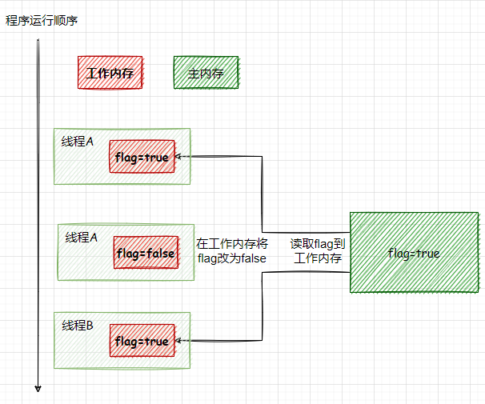
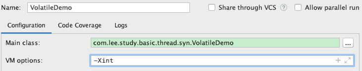

# 一、volatile能解决什么问题

`volatile`能保证在并发编程中共享变量的可见性以及有序性

# 二、可见性

## 2.1 可见性

**什么是可见性**

可见性就是当一个线程修改了共享变量，其它线程能够立马得知这个修改。

**可见性问题**

可见性问题就是当一个线程修改了共享变量，其它线程无法得知这个修改。

**为什么会有可见性问题**

`JMM`规定所有变量都存储在主内存当中，主内存是所有线程共享的，每个线程都有自己的工作内存，当线程要对变量进行读取和赋值操作时都必须把主内存的变量拷贝一份到自己的工作内存中，不能直接对主内存的变量直接操作，线程之间也不能互相访问对方的工作内存。

这样就会造成可见性问题，就是同一个变量，线程`A`读取了做了修改，还没有更新到主内存，线程`B`这个时候去主内存读取，就会导致线程`B`读到的变量不是最新的。

<div align=center></div>

## 2.2 代码验证

### 用代码复现可见性问题

在学习`volatile`的时候看了很多博客和资料，最后实际在用代码演示可见性问题的时候发现和网上很多都有出入。

下面我们写一段可见性问题的代码，有连个线程`t1`和`t2`，线程`t1`读取了共享变量`flag`到自己的工作内存，然后一直做循环，线程`t2`也读取这个共享变`flag`到自己的工作内存，然后修改了`flag`的值为`flase`，根据`JMM`规范`t2`对`flag`的修改是对`t1`不可见的。所以就会有可见性问题，表现的现象就是线程`t1`会一直循环不会结束。

运行这个程序，发现线程`t1`能顺利的结束，难道说没有可见性问题

> 不要在while循环里面使用System.out.println，println方法是加了synchronized的。

```java
public class VolatileDemo {
    private volatile static boolean flag = true;
    public static void main(String[] args) throws Exception{
        Thread t1 = new Thread(() -> {
            while (flag) { }
        });
        t1.start();

        Thread t2 = new Thread(() -> flag=false);
        t2.start();
    }
}
```

### 没有可见性问题？

这个问题一度困扰了我很久，后来看到网上很多例子都在`t1.start()`后面加了一行代码`Thread.sleep(1000)`，发现确实可以出现可见性问题，难道可见性问题和线程睡眠有关系？

**那么这里出现可见性问题的原因是什么呢？**

找了很久资料，甚至上B站着了`volatile`相关的视频，后来在黑马的视频中发现了一个相关的解释，这里当我们使用`Thread.sleep(1000)`的时候会出现可见性问题，也就是线程`t1`不会结束，其实和`JMM`没关系，而是有一个东西在作怪，那就是`JIT`，

当调用代码`Thread.sleep(1000)`的时候，线程`t1`会一直运行，于是`JIT`就判断这段代码是热点代码，于是`JIT`就把这段代码缓存起来，直接把`while(flag)`直接换成`while(true)`，所以当线程`t2`修改了变量的值，线程`t1`是无法感知的。

**那么如何验证是JIT的原因呢？**

很简单，我们在`vm`启动的时候关闭`jit`编译模式，使用解释模式。看看是否还有可见性问题。

```java
public class VolatileDemo {
    private volatile static boolean flag = true;
    public static void main(String[] args) throws Exception{
        Thread t1 = new Thread(() -> {
            while (flag) { }
        });
        t1.start();
				Thread.sleep(1000);
        Thread t2 = new Thread(() -> flag=false);
        t2.start();
    }
}
```

同样是上面那段代码，我们在启动的时候添加虚拟机参数`-Xint`

<div align=center></div>

现在我们发现这个时候就算是睡眠就不会有可见性问题（有可能有）。

### 可见性问题的原因

通过上面的例子，我们可以总结出造成可见性问题其实有两个原因

**JMM原因**

`JMM`规定的主内存，可能会导致可见性问题，并不是一定会有可见性问题，因为硬件层面还有自己的缓存一致性技术来保障，所以`JMM`只是不保证可见性，但是并不一定会出现可见性问题。

**JIT原因**

程序在运行的时候`JIT`会判断热点代码进行优化，会导致可见性问题。

除了上述原因还有指令重排也会导致可见性问题。

所以不管是`JMM`还是`JIT`的原因都可能会出现可见性问题，为了写出正确的程序，我们都要加上`volatile`关键字来保证可见性，不加不一定会出现可见性问题，加了就一定没有可见性问题。

## 2.3 保证可见性

### 如何保证可见性

**对于JMM原因来说**

被`volatile`关键字修饰的共享变量，在修改后会立即同步到主内存当中，每次在使用的时候都会从主内存中重新获取这个变量，防止它前面的指令从内存中读取的变量，已经被修改了。

**对于JIT原因来说**

被`volatile`修饰的变量，禁止`JIT`去优化它。

> 注意：volaile保证不了多个线程都在写的可见性 ，只能是一个写多个读

### 原理

我们用一段代码来演示`volaitle`保证可见性的底层原理，代码如下，全局变量用`volatile`来修饰。

```java
public class VolatileDemo {
    private volatile static boolean flag = true;
    public static void main(String[] args) throws Exception{
        Thread t1 = new Thread(() -> {
            while (flag) { }
        });
        t1.start();

        Thread.sleep(1000);

        Thread t2 = new Thread(() -> flag=false);
        t2.start();
    }
}
```

我们在运行这段代码的时候打印出它的汇编，在启动的时候添加虚拟机参数如下`-server -Xcomp -XX:+UnlockDiagnosticVMOptions -XX:+PrintAssembly -XX:CompileCommand=compileonly,VolatileDemo.main`

解释一下介个参数的意思

- -Xcomp：让`JVM`以编译的方式执行代码，`JVM`在首次运行把所有字节码编译为本地代码
- -XX:+UnlockDiagnosticVMOptions：解锁诊断功能
- -XX:+PrintAssembly：打印汇编代码
- -XX:CompileCommand=compileonly,类名.方法名：打印指定的方法

打印出来的汇编代码如下，我们只看关键地方，当我们在共享变量前添加了`volatile`关键字之后，对`flag`变量操作的汇编语句前面都有一个`lock`指令。

```assembly
0x000000010e5f7dbf: lock addl $0x0,(%rsp)     ;*putstatic flag
```

当变量被`volatile`关键字修饰的时候，会有`lock`指令，`cpu`在收到这个指令之后，会将当前`cpu`缓存里面的数据修改后立即写回系统内存，其它`cpu`缓存的数据就会失效。在硬件层面计算机也有保证线程安全的机制，那就是缓存一致性协议，各个处理器通过嗅探总线上的数据来自己缓存的数据是否需要更新，如果发现自己缓存的数据已经失效，会从主内存里面获取最新的值。

在打印汇编代码的的时候可能会报错，可以参考另外一篇文章

[查看java汇编源码报错：Could not load hsdis-amd64.dll](https://blog.csdn.net/lhm964517471/article/details/130759432)

# 三、有序性

## 3.1 有序性

**有序性**

有序性就是程序的执行顺序和代码的先后顺序一致。

**什么是有序性问题**

那就是程序的执行顺序和代码的先后顺序不一致。

**造成有序性问题的原因**

造成可见性的主要原因就是重排序。
在单线程的环境下`JVM`和处理器都要遵守`as-if-serial`语义，也就是无论怎么重排序，程序的执行结果都不能改变。因为编译器和处理器都不会对存在数据依赖关系的做重排序。但是如果操作之间不存在数据依赖关系，这些操作可能被编译器和处理器重排序。而这样的重排序对于多线程的情况会导致可见性问题。

重排序主要分为三种：

**编译器优化的重排序**：编译器在不改变单线程语义的前提下，改变代码的执行顺序。
**指令并行的重排序**：如果代码语句不存在数据依赖，即后一个不依赖前一个执行的结果，处理器可以改变代码语句对应的机器指令的执行顺序来充分利用处理器资源。
**内存系统的重排序**：由于计算机的缓存设计，使得读取和写入数据看上去是乱序执行。

## 3.2 如何保证有序性

通过使用`volatile`关键字来保证有序性，而`volatile`通过禁止指令重排优化保证有序性。通过禁止指令重排优化，就可以保证代码程序会严格按照代码的先后顺序执行。

## 3.3 如何禁止指令重排

`volatile`是通过**内存屏障**来禁止指令重排的，内存屏障有两个作用，阻止屏障两侧的代码重排序和强制把缓存中的数据刷新会主存。

## 3.4 保证有序性

JVM屏蔽了硬件差异，抽象了四种内存屏障

**LoadLoad**：作用于语句`Load1;LoadLoad;Load2;`该屏障可以保证在`Load2`读取数据之前，`Load1`读取数据已经完成。

**StoreStore**：作用于语句`Store1;StoreStore;Store2;`该屏障可以保障在`Store2`写入之前，`Store1`会被强制刷新回主存，`Store1`写入的数据对其它处理器可见。

**LoadStore**：作用于语句`Load1;LoadStore;Store2;`该屏障保证在`Store2`写入之前，`Load1`读取数据要已经完成。

**StoreLoad**：作用于语句`Store1;StoreLoad;Load2;`该屏障保证在`Load2`操作的时候，`Store1`写入的数据已经刷新回主存了，对其它处理器都可见。

那么什么时候需要内存屏障指令呢，用下面一张表来表示

|            | 第二个操作 | 普通读   | 普通写    | volatile读 | volatile写 |
| ---------- | ---------- | -------- | --------- | ---------- | ---------- |
| 第一个操作 |            |          |           |            |            |
| 普通读     |            |          |           |            | LoadStore  |
| 普通写     |            |          |           |            | StoreStore |
| volatile读 |            | LoadLoad | LoadStore | LoadLoad   | LoadStore  |
| volatile写 |            |          |           | StoreLoad  | StoreStore |

总结一下就就三句话

- 第一个操作是`volatile`读，第二个操作无论是什么都不能重排序
- 第一个操作是`volatile`写，第二个操作如果是`volatile`读就不能重排序
- 第二个操作是`volatile`写，第一个操作无论是什么都不能重排序


**参考资料**：

- https://blog.csdn.net/u013291050/article/details/117335477

- http://concurrent.redspider.group/article/02/8.html


