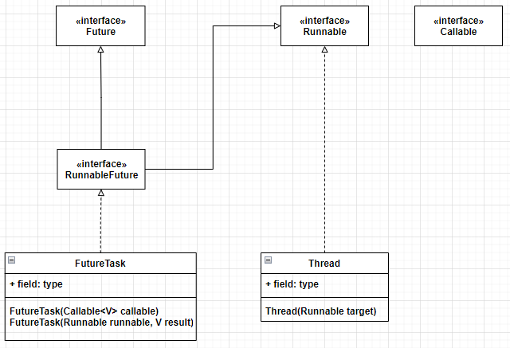
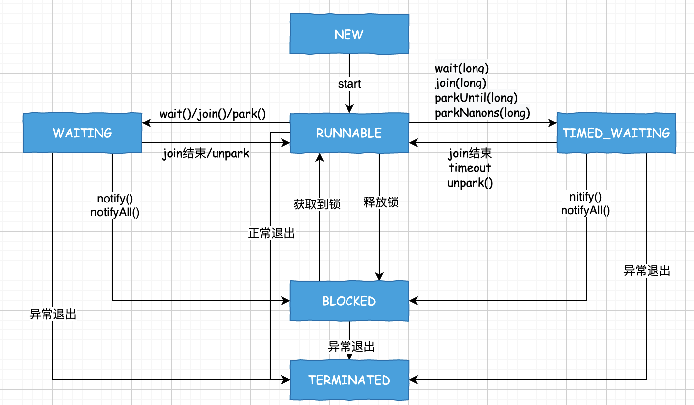
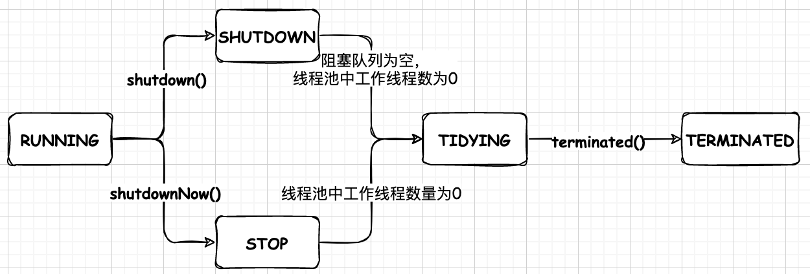
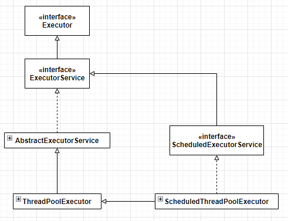
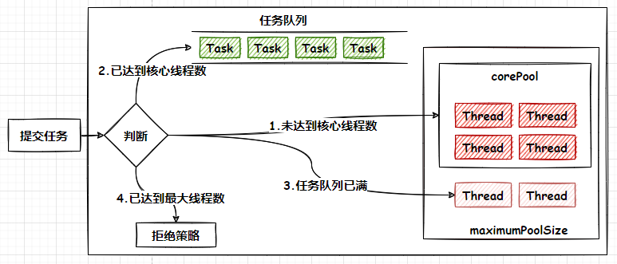

# 线程

## 线程和进程

进程是操作系统分配资源的最小单位，而线程是程序执行的最小单位，他们都是可以并发执行的。一个进程至少有一个线程，这些线程共享进程的资源空间。

## 线程简介

每个线程都有一个优先级，高优先级的线程比低优先级的线程先执行。优先级的取值范围是1到10的整数，默认是5。每个线程有可能被标记为一个守护线程。当一个线程创建另外一个新的线程对象，新的线程的优先级等于创建他的线程的优先级；如果新的线程对象是一个守护线程当且仅当创建他的线程是一个守护线程。

## 线程分类

Java线程分为**守护线程(Daemon Thread)**和**用户线程(User Thread)**。守护线程和用户线程基本上是一样的，唯一的区别是如果用户线程全部退出运行了，不管有没有守护线程虚拟机都会退出。守护线程的作用是为其他的线程的运行提供服务，最典型的守护线程就是`GC`(垃圾回收期)。

## 线程的继承体系

<div align=center></div>

- Runnable

  `Runable`是一个在`jdk1.0`提供的一个接口，并且是在`java.lang`包下面，这个接口可以被任何类实现，并且实现类要重写`run`方法，实现这个接口的类的对象可以被一个线程执行。
  
- Callable

  `Callable`是和在`jdk1.5`提供的一个接口，和`Runnable`的作用一样，但是实现`Callable`接口的类，重写的方法叫做`call`，并且该方法可以返回接口和抛出异常。`Callable`出现的目的就是解决`Runnable`没有返回值的缺陷。需要和`Future`搭配使用
  
- Future

  `Future`表示异步计算结果，提供了一些方法用于检查计算是否结束，等待计算结束获获取计算结果。当计算结束后，只能通过get方法获取计算结果。还可以通过`cancel`方法取消计算，但是一个计算已经完成，计算就不能被取消。
- Thread
  `Thread`是程序执行中的线程，`java`虚拟机允许程序中多个线程并行执行，每一个线程都有一个优先级，高优先级的线程比低优先级的线程先执行。每个线程都有可能被标记为守护线程，一个线程在运行中创建了另外一个线程，被创建的线程优先级等于创建它的线程，如果创建线程是守护线程，那么被创建的线程也是守护线程。

# 创建线程

## 创建线程的方式

创建一个线程类有三种方式：

- 继承Thread类
- 实现Runnable接口
- 实现Callable接口

## Thread

```java
public class ThreadDemo extends Thread {
	public void run() {
		for (int i = 0; i < 60; i++) {
			System.out.println(getName() + ":" + i);
		}
	}
}
public class Demo{
    public static void main(String[] args) {
        ThreadDemo t1 = new ThreadDemo();
		ThreadDemo t2 = new ThreadDemo();
		t1.start();
		t2.start();
    }
}
```

## Runnable

```java
public class Runnable implements Runnable{
    public void run() {
       public void run() {
           for (int i = 0; i < 60; i++) {
				System.out.println(Thread.currentThread().getName() + ":" + i);
           }
	   }
	}
}
public class Demo{
    public static void main(String[] args) {
        RunnableDemo run = new RunnableDemo();
        Thread t1 = new Thread(run);
        Thread t2 = new Thread(run);
        t1.start();
        t2.start();
    }
}
```

## Callable和Future

```java
public class MyCallable implements Callable<Integer> {
    public Integer call() {
        int sum = 0;
        for (int i = 0; i <= 100; i++) {
            sum += i;
        }
        return new Integer(sum);
    }
}
public class Demo{
    public static void main(String[] args) {
        MyCallable callable = new MyCallable();
        FutureTask<Integer> result = new FutureTask<Integer>(callable);
        new Thread(result).start();
        try {
            Integer value = result.get();
        } catch (InterruptedException e) {
            e.printStackTrace();
        } catch (ExecutionException e) {
            e.printStackTrace();
        }
    }
}
```

# 线程生命周期

## 线程状态

在Thread类中有一个内部枚举类State代表了线程的状态，一个线程从创建到销毁就是一个完整的生命周期。

```java
public enum State {
    /**
     * 线程被创建，还没有开始运行
     */
    NEW,
    /**
     * 线程可运行状态，运行状态的线程是正在被Java虚拟机执行，但是也可能正在等待操作系统的其他资源例如处理	   * 器
     */
    RUNNABLE,
    /**
     * 线程阻塞状态，等待监视器锁。处于阻塞状态线程是在等待监视器锁为了：进入同步代码块/方法或者在调用		 * Object.wait()方法之后重新进入同步代码/方法
     */
    BLOCKED,
    /**
     * 线程等待状态，一个线程处于等待状态由于调用了以下这几种方法：Object.wait;Thread.join;LockSupp
     * ort.park。处于等待的线程正在等待另一个线程执行一个特定的操作。
     */
    WAITING,
    /**
     * 线程超时等待状态，一个线程处于超时等待状态在一个特定的等待时间，由于调用了以下几个方法Thread.slee
     * p;Object.wait(long);Thread.join(long);LockSupport.parkNanos;LockSupport.parkUntil。
     */
    TIMED_WAITING,
    /**
     * 线程结束状态，线程已经执行完成了。
     */
    TERMINATED;
}
```

## 线程状态转换

### 线程状态转换图

线程从创建后就在几个状态中切换。下面是一个线程状态转换图，调用不同的方法就可以切换线程线程的状态。

<div align=center></div>

### 可运行状态-RUNNABLE

线程可运行状态是线程可以获取到`cpu`执行权，但不一定正在执行。所以线程在可运行状态可以细分为两个内部状态：准备运行`Ready`和正在运行`Running`。

- 从`Ready`到`Running`：获得`cpu`执行权

- 从`Running`到`Ready`：`cpu`时间片结束、线程礼让`Thread.yield`

>  调用yield线程会释放cpu资源，然后在系统的时间片之后继续竞争cpu资源，yield不会释放监视器锁。

```java
/**
 * 给调度器一个提示当前线程愿意让出当前使用的处理器，调度程序可以选择忽略这个提示。Yield是一个启发式的 
 * 尝试改善进程中的线程关系，否则会过度使用CPU，使用它应结合详细的分析和基准测试，确保达到预期的效果
 **/
public static native void yield();
```

### 等待-WAITING

线程处于`waiting`状态，会释放掉当前`cpu`资源，处于等待状态的线程需要被唤醒。线程在运行状态和等待状态切换有三种方式：`Object#wait()/notify()`、`Thread#join()`、`LockSupport#park()/unpark()`。

- Object#wait()/notify()

  `wait/notify`是属于`Object`类的方法，对象调用`wait`方法后会让当前持有对象锁的线程释放当前对象锁，并进入等待队列。对象调用`notify`后从等待队列随机选择一个线程唤醒去竞争对象锁。
  
  > notifyAll是唤醒等待对象的所有线程去竞争锁
  
  ```java
  public class Demo {
      public static void main(String[] args) {
          Demo demo = new Demo();
          Thread t1 = new Thread(() -> {
              synchronized (demo) {
                  System.out.println("t1 start");
                  try {
                      demo.wait();
                  } catch (InterruptedException e) {
                      e.printStackTrace();
                  }
                  System.out.println("t1 end");
              }
          });
          Thread t2 = new Thread(() -> {
             synchronized (demo) {
                 System.out.println("t2 start");
                 System.out.println("t2 end");
                 demo.notify();
             }
          });
          t1.start();
          t2.start();
      }
  }
  ```
  
- Thread#join()

  `join`方法是属于`Thread`类的，`join`方法是阻塞调用此方法的线程，例如在主线程中调用其它线程的`join`方法，阻塞的会是主线程。

  ```java
  public static void main(String[] args) throws InterruptedException {
      Thread t = new Thread(() -> {System.out.println("t");});
      t.start();
      t.join();
  }
  ```

  `join`方法是通过`Object.wait()`方法实现的，在`JDK`中的源码如下，通过循环判断线程`t`是否存活让主线程一直处于，获取对象锁释放对象锁这个过程，当`t`线程执行完毕之后也会去唤醒等待队列中的线程。

  在`hotspot/src/share/vm/runtime/thread.cpp`类中，线程退出`JavaThread::exit`会调用`ensure_join`方法，而在`ensure_join`方法内会调用`lock.notify_all(thread)`，唤醒处于等待的线程

  ```java
  /**
   * 省略了部分代码，join方法是一个被synchronized修饰的同步方法，所以调用线程的join方法，首先会去获取 
   * 线程对象的对象锁
   */ 
  public final synchronized void join(long millis){
      // 当线程t存活的时候
      while (isAlive()) {
          // 调用对象的wait方法，此时持有对象锁的main线程会进入等待队列，
          // 这里时间是0，所以main线程又会去竞争对象锁，直到t线程死亡
          wait(0);
      }
  }
  ```

- LockSupport#park()/unpark()

  `LockSupport`是一个工具类是属于类的，`LockSupport`是一个线程阻塞工具类，所有的方法都是静态方法，可以使用`park`方法来阻塞线程，使用`unpart`来唤醒线程。

  ```java
  public class Demo {
      public static void main(String[] args) {
          System.out.println("main start");
          Thread t1 = new Thread(() -> {
              System.out.println("t1 start");
              LockSupport.park();
              System.out.println("t1 end");
          });
          t1.start();
          LockSupport.unpark(t1);
          System.out.println("main end");
      }
  }
  ```

### 超时等待-TIMED_WAITING

`TIMED_WAITING`和`WAITING`类似，差异在于`TIMED_WAITING`有时间的限制。

- wait(long)：等待到时间之后就会自动的唤醒，也可以通过`notify`主动唤醒
- join(long)：调用`join`之后线程会阻塞到到达阻塞时间或者调用的线程对象执行完成

- parkUntil(long)和parkNanos(long)：`parkNanons`是阻塞`long`时间，`parkUntil`是阻塞截止到`long`时间。


```java
public class Demo {
    public static void main(String[] args) {
        System.out.println("main start");
        Thread t1 = new Thread(() -> {
            System.out.println("t1 start");
            LockSupport.parkNanos(3000000000L);
            System.out.println("t1 end");
        });
        t1.start();
        System.out.println("main end");
    }
}
```

```java
public class Demo {
    public static void main(String[] args) throws Exception{
        System.out.println("main start");
        Thread t1 = new Thread(() -> {
            System.out.println("t1 start");
            String dateTimeStr = "2021-04-04 14:57:00";
            DateTimeFormatter df = DateTimeFormatter.ofPattern("yyyy-MM-dd HH:mm:ss");
            LocalDateTime dateTime = LocalDateTime.parse(dateTimeStr, df); 		       LockSupport.parkUntil(dateTime.toInstant(ZoneOffset.of("+8")).toEpochMilli());
            System.out.println("t1 end");
        });
        t1.start();
        System.out.println("main end");
    }
}
```

### 阻塞-BLOCKED

线程`BLOCKED`是对象锁独有的，当线程被`notify`之后就会处于阻塞状态，并且会去尝试获取锁，如果获取到对象锁就处于`Runnable`，如果没有获取到对象锁就会处于`Blocked`状态

```java
/**
 * 是当前正在执行的线程休眠指定的毫秒数，线程不会释放拥有的监视器锁
 */
public static native void sleep(long millis) throws InterruptedException;
```

# 线程池

## 线程池概述

假设一个服务器完成一项任务所需时间为: 创建线程时间T1，在线程中执行时间T2,销毁线程时间T3。如果T1和T3大于T2那么就可以采用线程池技术提高服务器性能。

线程池技术关注与调整或缩短T1,T3的时间的技术，它把T1，T3分别安排在服务器程序启动和结束的时间段或者一些空闲的时间段，这样在服务器处理客户请求时，不会有T1，T3的开销了。

## 线程池状态

### 状态

线程池内部维护了线程池的运行状态，运行状态包括了五种

| 运行状态   | 描述                                                         |
| ---------- | ------------------------------------------------------------ |
| RUNNING    | 正在运行，可以向线程池中提交新任务，也可以从执行任务队列中的任务 |
| SHUTDOWN   | 关闭状态，不能向线程池提交新任务，但是可以执行任务队列中的任务 |
| STOP       | 不能提交任务，也不能执行任务队列中的任务，会中断正在处理任务的线程 |
| TIDYING    | 所有任务都已中止，有效线程数为0                              |
| TERMINATED | 执行`rerminated`方法后进入该状态。                           |

在线程池内部是通过六个`int类型`的字段来表示线程池的运行状态

```java
public static final int SIZE = 32;
private static final int COUNT_BITS = Integer.SIZE - 3;
// 线程池运行状态，全部左移了29位
private static final int RUNNING    = -1 << COUNT_BITS;
private static final int SHUTDOWN   =  0 << COUNT_BITS;
private static final int STOP       =  1 << COUNT_BITS;
private static final int TIDYING    =  2 << COUNT_BITS;
private static final int TERMINATED =  3 << COUNT_BITS;
```

但是程序实际上用来表示线程池状态的是和有效线程数量一起的，用一个变量`ctl`来表示的，高三位表示线程池运行状态，低二十九位表示有效线程数量。

```java
// 表示线程池运行状态和有效线程数量
private final AtomicInteger ctl = new AtomicInteger(ctlOf(RUNNING, 0));

private static int ctlOf(int rs, int wc) { 
	return rs | wc; 
}
```

### 状态转换

<div align=center></div>

## 继承体系

<div align=center></div>

## 线程池概念

### 构造方法

在`Java`中`ThreadPoolExecutor`类是线程池的核心类，通过这个类可以执行创建线程池，提交任务等相关操作，`ThreadPoolExecutor`提供了四种构造方法用于创建线程池。其中`corePoolSize`、`maximunPoolSize`、`keepAliveTime`、`unit`、`workQueue`是固定的参数，`handler`、和`threadFactory`是可选的参数。

这几个参数还是要介绍一下

```java
/**
 * corePoolSize: 核心线程池数
 * maximumPoolSize：最大线程池
 * keepAliveTime：存活时间
 * unit：存活时间单位
 * workQueue：工作队列
 */
public ThreadPoolExecutor(int corePoolSize,int maximumPoolSize,long keepAliveTime,
                          TimeUnit unit,BlockingQueue<Runnable> workQueue) {
}
/**
 * handler：拒绝策略
 */
public ThreadPoolExecutor(int corePoolSize,int maximumPoolSize,long keepAliveTime,
                          TimeUnit unit,BlockingQueue<Runnable> workQueue,
                          RejectedExecutionHandler handler) {
}
/**
 * threadFactory：线程工厂
 */
public ThreadPoolExecutor(int corePoolSize,int maximumPoolSize,long keepAliveTime,
                          TimeUnit unit,BlockingQueue<Runnable> workQueue,
                          ThreadFactory threadFactory) {
}
/**
 * threadFactory：线程工厂
 * handler：拒绝策略
 */
public ThreadPoolExecutor(int corePoolSize,int maximumPoolSize,long keepAliveTime,
                          TimeUnit unit,BlockingQueue<Runnable> workQueue,
                          ThreadFactory threadFactory,RejectedExecutionHandler handler) {
}
```

### 任务队列

任务队列用于存放往线程池提交的任务，当线程数达到核心线程数，继续往线程池中提交任务，这个时候任务就会放到任务队列中。`Java`提供了队列的接口`BlockingQueue`，并且提供了七种实现实现。

- ArrayBlockingQueue：数组阻塞队列，有长度限制
- LinkedBlockingQueue：链表阻塞队列，默认长度为`Integer.MAX_VALUE`
- PriorityBlockingQueue：支持优先级排序的阻塞队列，不限制长度
- DelayQueue：延迟队列，基于二叉堆实现，不限制长度
- SynchronousQueue：同步队列，有长度限制
- LinkedBlockingDeque：双端队列，基于链表实现，没有长度限制
- LinkedTransferQueue：链表结构队列，没有长度限制

### 拒绝策略

当线程池的队列已经满了，并且线程数也已经达到最大线程数，这个时候如果再继续想线程池中提交任务，线程池就会采用拒绝策略来拒绝任务。

`Java`提供了拒绝策略接口`RejectedExecutionHandler`，在实际使用过程中我们可以继承该接口，然后实现`rejectedExecution`方法，在方法里面实现拒绝任务的逻辑。

```java
public interface RejectedExecutionHandler {
    void rejectedExecution(Runnable r, ThreadPoolExecutor executor);
}
```

`Java`也提供了四种默认实现的拒绝策略。这是四种策略都是`ThreadPoolExecutor`的静态内部类。

```java
// 由调用的线程执行该任务
public static class CallerRunsPolicy implements RejectedExecutionHandler

// 丢弃任务并抛出RejectedExecutionException异常，这个是线程池的默认策略
public static class AbortPolicy implements RejectedExecutionHandler

// 直接丢弃任务，不做任务操作
public static class DiscardPolicy implements RejectedExecutionHandler

// 丢弃队列第一个任务，然后重新提交被拒绝的任务
public static class DiscardOldestPolicy implements RejectedExecutionHandler
```

### 线程工厂

线程工厂用于创建线程，线程工厂接口`ThreadFactory`，`Java`中提供了两种工厂，都是线程工具类`Executors`实现的，`DefaultThreadFactory`和 `PrivilegedThreadFactory`后者是继承前者的。

## 运行流程

1.当提交一个任务的时候，线程池内部进行判断如何处理任务

2.如果线程池的线程数未达到核心线程数，就创建线程执行任务

3.如果线程池的线程数达到核心线程数，就把任务放到任务队列中

4.如果任务队列是有界任务队列，那么当任务队列满了之后，就创建非核心线程来执行任务，这里有一个区分就是，如果是无界队列，那么就会一直往里放，那么最大线程数和拒绝策略也就失去意义了

5.如果线程池线程数已经达到最大线程数，那么就会根据线程池的拒绝策略来拒绝任务

> 提交优先级和执行优先级
>
> 提交优先级：核心线程、任务队列、非核心线程
>
> 执行优先级：核心线程、非核心线程、任务队列

<div align=center></div>

## 源码分析

### 提交任务

- 方法描述

  线程池提交任务有两种方式`execute`和`submit`两种方式，`execute`是顶层接口`Executor`定义的方法，在`ThreadPoolExecutor`中实现的，`submit`是在`ExecutorService`接口中定义的，`AbstractExecutorService`中实现的。

  `execute`只能接受`Runnable`参数。

  ```java
  void execute(Runnable command);
  ```

  `submit`可以接受`Callable`和`Runnable`两种类型的参数，`submit`实际上也是通过`execute`来实现的，将提交的任务封装成`RunnableFuture`。

  ```java
  <T> Future<T> submit(Callable<T> task);
  <T> Future<T> submit(Runnable task, T result);
  Future<?> submit(Runnable task);
  ```

- 源码分析

  ```java
  public void execute(Runnable command) {
    // 如果任务为空，直接抛出异常 
    if (command == null) {
      throw new NullPointerException();
    }
    // 这个数高位表示线程池运行状态，低位表示
    int c = ctl.get();
    // 如果工作线程数小于核心线程数
    if (workerCountOf(c) < corePoolSize) {
      // TODO 添加成功之后，就直接返回
      if (addWorker(command, true))
        return;
      // 添加失败，再次获取表示线程池状态的数
      c = ctl.get();
    }
    // 如果线程池处于运行状态，并且将任务保存到了阻塞队列中
    if (isRunning(c) && workQueue.offer(command)) {
      int recheck = ctl.get();
      // 入队列之前，倘若线程池shutdown状态，就执行remove
      // 如果线程池没有处于运行状态，并且从阻塞队列中移除任务成功，就执行拒绝策略
      if (! isRunning(recheck) && remove(command))
        reject(command);
      // 线程池处于running，但是没有工作线程，就创建工作线程
      else if (workerCountOf(recheck) == 0)
        addWorker(null, false);
    }
    // 往线程池中创建新的线程失败，就执行拒绝策略
    else if (!addWorker(command, false))
      reject(command);
  }
  ```

