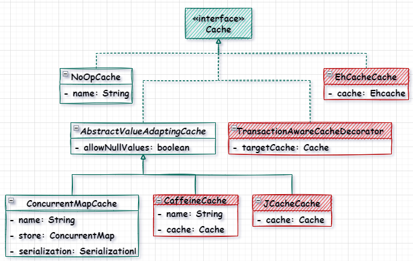
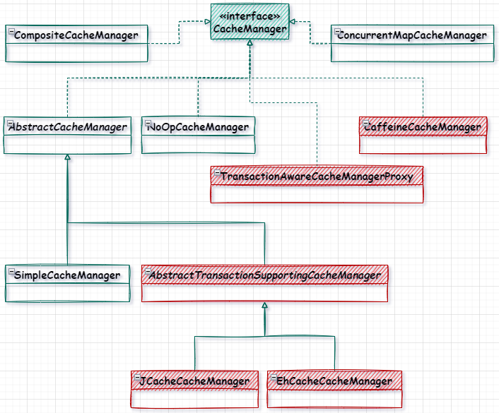

# :grapes:一、SpringCache介绍

## 1. 1概述

在`Java`中缓存是让一些经常使用的元素，放到内存中，这样能提高元素的存取速度，`Spring Cache`是`spring3.1`引入的基于注解的一个缓存技术，它是对缓存的一个抽象，有自己的缓存实现方案，在`spring Cache`中相关的几个`jar`包关系如下：

:1st_place_medal:`spring-context`：提供了缓存的顶层接口`Cache`和`CacheManager`，还对这两个接口做了自己的实现。

:2nd_place_medal:`spring-context-support`：扩展了对`Cache`和`CacheManager`实现。

:3rd_place_medal:`spring-boot-starter-cache`：实际上是引入了`spring-context-support`包。

## 1.2.缓存实现体系

### 1.2.1.Cache

`Cache`是一个接口，是`Spring`定义的缓存规范，用于操作缓存数据，如将数据放进缓存中，从缓存中将数据取出来，都是通过`Cache`来操作的，我们自定义缓存可以通过实现`Cache`接口来实现，在下图中，淡绿色框的是`spring-context`中实现缓存的类，红色的是在`spring-context-support`包中实现缓存的类。注意其中两个：`CaffeineCache`和`JCacheCache`，这两个缓存在使用的时候还需要导入`caffeine`和`jcache`包。



### 1.2.2.CacheManager

`CacheManager`是用来管理`Cache`的，如初始化`Cache`对象，获取`Cache`对象信息等，在`CacheManager`中维护了一个`map`来管理`Cache`，`map`的`key`是`Cache`的名称，值就是`Cache`。在下图中，淡绿色框的是`spring-context`中实现缓存管理类，红色的是在`spring-context-support`包中实现缓存管理类。



## 1.4.缓存框架

### 1.4.1.本地缓存框架

- Caffeine：`Caffeine`是使用`Java8`对`Guava`缓存的重写版本，在`Spring Boot 2.0`中将取代`Guava`，基于`LRU`算法实现，支持多种缓存过期策略。

- ehcache：是一个纯`Java`的进程内缓存框架，具有快速、精干等特点，是`Hibernate`中默认的` CacheProvider`。
- GuavaCache：`Google Guava`工具包中的一个非常方便易用的本地化缓存实现，基于`LRU`算法实现，支持多种缓存过期策略。

### 1.4.2.远程缓存

除了将数据缓存在本地之外，还可以将数据缓存在远程，远程缓存方式可用：`redis`、`memcached`、`gemfire`。

### 1.4.3. 组合缓存

有时候也需要将本地和远程缓存组合起来是用，可以通过`Jetcache`将两者结合起来，如本地缓存使用`caffeine`，远程缓存是用`redis`。

# :watermelon:二、Spring Cache基础

## 2.1.默认缓存

在`SpringBoot`中使用`Spring Cache`需要先使用注解`@EnableCaching`开启缓存。可以先看一下在`SpringBoot`中默认的缓存，可以看出`Spring Cache`默认是使用的`ConcurrentMapCache`。

```java
@SpringBootTest
class StudyApplicationTests {
  @Autowired
	private CacheManager cacheManager;

	@Test
	void testDefaultCache() {
  	System.out.println(cacheManager.getClass());
	}
}
// class org.springframework.cache.concurrent.ConcurrentMapCacheManager
```

## 2.2.注解缓存

### 2.2.1.注解缓存介绍

在`Spring3.1`中就引入了基于注解的缓存解决方案，和缓存相关的有以下几个注解

- @EnableCache：作用于类上面，用于开启缓存
- @Cacheable：调用方法时先从缓存中查，如果缓存中没找到再执行方法，并将方法返回值存储在缓存中。

- @CachePut：调用方法的返回值放在缓存中，源码和@Cacheable类似
- @CacheEvict：清空缓存，一般用在更新或删除的方法上
- @CacheConfig：用在类上面，缓存的通用配置
- @Caching：组合缓存，可将Cacheable、CacheEvict、CachePut组合起来使用

### 2.2.2.注解缓存的属性

🐒**1.value**

​	用来指定存放数据的缓存，支持同时设置多个缓存

**🐕2.cacheNames**

​	和`value`一样，是在`Spring`4.2新增的属性

**🐈3.key**

​	放到缓存中值的`key`，默认是用方法的参数作为`key`，`key`可以使用`spEl`表达式来编写。如果不指定`key`，就会默认使用`SimpleKey`来生成`key`。

​	`key`在缓存中通常的格式是`缓存名称::key`

**🦓4.keyGenerator**

​	`key`生成器，可以自定义`key`生成器来生成`key`。自定义`key`生成器需要实现`KeyGenerator`接口。

**🐖5.condition**

​	调用方法之前判断`condition`里面的表达式，只有表达式为`true`的时候才将数据放入缓存。

**🐑6.unless**

​	调用方法之后判断`unless`里面的表达式，只有表达式为`false`才将数据放到缓存中。如果调用方法的时候能从缓存中获取值，`unless`的判断就不会生效了，因为能从缓存中获取数据，就不会执行方法了。

**🐇7.sync**

​	这个是在`Spring`4.3新增的一个属性，为了解决缓存穿透问题，当一个`key`过期之后，多个线程同时去获取这个`key`的数据，没有获取到会同时去请求数据库，导致数据库的访问量突然增大。将`sync`设置为`true`的时候，只   有一个线程去数据库获取值，并将值放到缓存中，其它线程从缓存中取值，将少了数据库的负载。默认是`false`

# :kiwi_fruit:三、SpringCache使用

`SpringCache`的使用，这里以`Redis`作为缓存的具体实现，可以很方便看到在缓存中的数据。

## 3.1. 配置缓存

## 3.2.开启缓存

在`SpringBoot`的启动类上面加上`@EnableCache`注解开启缓存。

## 3.3.使用缓存

- @Cacheable

```java
private final static Map<String, String> map = new HashMap<>();

static {
  map.put("1", "1value");
  map.put("2", "2value");
  map.put("3", "3value");
}

/*
 * 1.首先从缓存中根据id去查找，如果能找到直接从缓存中返回结果
 * 2.如果缓存中找不到，再执行方法
 * 3.将方法的返回值放进缓存中
 */
@GetMapping("/user/{id}")
@Cacheable(value = "myCache", key = "#id")
public String getUser(@PathVariable String id) {
  log.info("进入方法");
  String result = map.get(id);
  log.info("离开方法");
  return result;
}
```


- Cacheput

```java
private final static Map<String, String> map = new HashMap<>();

static {
  map.put("1", "1value");
  map.put("2", "2value");
  map.put("3", "3value");
}

/*
 * 1.执行方法之后，将返回值放进缓存中
 * 2.如果key存在就更新，没有就新增
 */
@GetMapping("/user/update/{id}")
@CachePut(value = "myCache", key = "#id")
public String updateUser(@PathVariable("id") String id) {
  map.put(id, "new1Value");
  return "success";
}
```

- CacheEvict

```java
/*
 * 1.删除指定key的缓存数据
 */
@GetMapping("/user/delete/{id}")
@CacheEvict(value = "myCache", key = "#id")
public String deleteUser(@PathVariable("id")String id) {
  return "success";
}
```

- CacheConfig

上面几个缓存注解，都有一个通用的属性，那就是value，这种通用的属性可以使用CacheConfig注解配置，@CacheConfig(cacheNames = "myCache")

# :avocado:四、SpringCache源码解析

## 4.1.默认缓存

在`SpringBoot`项目启动的时候，会去初始化默认的缓存对象，我们可以在`spring-boot-autoconfigure`的`cache`包里面找到`SpringBoot`支持的缓存类型，可以看到有：`CaffeineCacheConfiguration`、`RedisCacheConfiguration`、`SimpleCacheConfiguration`等等，这些缓存配置类需要做一件事就是初始化一个`CacheManager`的`bean`。

那么`SpringBoot`是如何决定使用哪个缓存呢？

- @SpringBootApplication

  `@SpringBootApplication`注解引入了`@EnableAutoConfiguration`注解

- @EnableAutoConfiguration

  `@EnableAutoConfiguration`这个注解导入了`AutoConfigurationImportSelector`这个类

  ```java
  @Import(AutoConfigurationImportSelector.class)
  public @interface EnableAutoConfiguration {}
  ```

- AutoConfigurationImportSelector

  在`AutoConfigurationImportSelector`这个类里面调用了 `SpringFactoriesLoader`类的`loadFactoryNames`方法。这个方法主要是去找`spring-boot-autoconfigure`这个`jar`包的`META-INF/spring.factories`文件里面需要导入的配置类，在这个配置文件可以看到缓存的配置类`CacheAutoConfiguration`，这个类就是用来自动配置缓存的。

- CacheAutoConfiguration

  `CacheAutoConfiguration`导入了一个类叫做`CacheConfigurationImportSelector`

  ```java
  @Import({ CacheConfigurationImportSelector.class, CacheManagerEntityManagerFactoryDependsOnPostProcessor.class })
  public class CacheAutoConfiguration {}
  ```

- CacheConfigurationImportSelector

  `CacheConfigurationImportSelector`类就干了一件事，导入缓存配置类，看下面源码可以看到，是从一个枚举类`CacheType`按顺序导入缓存配置类的。

  ```java
  public String[] selectImports(AnnotationMetadata importingClassMetadata) {
      CacheType[] types = CacheType.values();
      String[] imports = new String[types.length];
      for (int i = 0; i < types.length; i++) {
          imports[i] = CacheConfigurations.getConfigurationClass(types[i]);
      }
      return imports;
  }
  ```

- CacheType

  这个枚举类就是Spring Cache中支持的缓存类型

  ```java
  public enum CacheType {
  	GENERIC,
  	JCACHE,
  	EHCACHE,
  	HAZELCAST,
  	INFINISPAN,
  	COUCHBASE,
  	REDIS,
  	CAFFEINE,
  	SIMPLE,
  	NONE
  }
  ```

那么这么多缓存类型加载进来，`SpringBoot`是如何决定使用的，这里我们需要看下缓存的配置类，这里我们以`CaffeineCacheConfiguration`为例，可以看到有一个要初始化这个类，还有一个条件就是`@ConditionalOnMissingBean(CacheManager.class)`，意思就是没有`CacheManager`这个`Bean`的时候，才会初始化这个缓存配置类，

所以这里就知道为什么默认是`SIMPLE`这个了，当你没有导入对应的`jar`包，肯定是不会初始化的，系统自带的`SIMPLE`在`NONE`的前面，当初始化了`SIMPLE`，再去初始化`NONE`的时候通过`@ConditionalOnMissingBean`去检测，发现已经初始化了`CacheManager`这个`bean`了，也就不会初始化了。

```java
@ConditionalOnMissingBean(CacheManager.class)
class CaffeineCacheConfiguration {}
```
